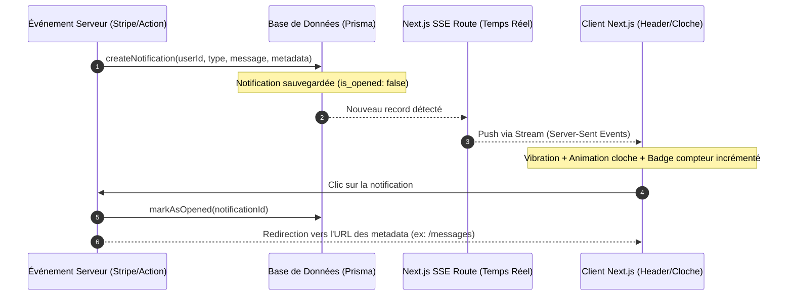

# 🔔 Architecture & Système de Gestion des Notifications In-App

Ce document décrit l'architecture, les spécifications techniques et les étapes d'implémentation pour doter l'application **PlayAgain** d'un système complet et premium de notifications en temps réel (in-app). Ce système exploitera le modèle Prisma `Notification` déjà présent dans votre base de données pour notifier les utilisateurs lors des événements clés (achats, ventes, nouveaux messages, alertes IA).

---

## 1. 🔄 Le Flux Global des Notifications

Le schéma ci-dessous illustre le cycle de vie d'une notification, de sa création en base de données par un événement serveur jusqu'à sa réception et sa lecture en temps réel côté client :



---

## 2. 🗄️ Modélisation des Données & Structure des Métadonnées

Le modèle Prisma `Notification` existant est parfaitement adapté. Nous allons définir précisément comment exploiter ses colonnes :

```prisma
model Notification {
  id              Int      @id @default(autoincrement())
  user_id         Int
  type            String   @db.VarChar(50)  // "MESSAGE", "TRANSACTION", "SYSTEM", "AI_MATCH"
  message         String   @db.Text         // Le contenu textuel affiché
  is_opened       Boolean  @default(false)  // État de lecture (lu/non lu)
  metadata        Json?                     // Informations contextuelles
  created_at      DateTime @default(now())
  
  user            User     @relation(fields: [user_id], references: [id])
}
```

### 📍 Structure recommandée pour le champ `metadata`

Pour rendre le système ultra-dynamique, le champ `metadata` doit contenir l'URL cible de redirection au clic et des informations pour enrichir le rendu visuel.

#### A. Type : `TRANSACTION` (Achat validé / Colis expédié / Fonds libérés)
```json
{
  "redirectUrl": "/profile",
  "invoiceId": 12,
  "productId": 45,
  "productTitle": "Chaussures de Ski Salomon S/Pro 100",
  "productImageUrl": "/uploads/products/45_image.jpg", // Nouveau : Image miniature de l'article
  "icon": "package"
}
```

#### B. Type : `MESSAGE` (Nouveau message dans le chat)
```json
{
  "redirectUrl": "/messages?conversationId=8",
  "conversationId": 8,
  "senderName": "test2",
  "senderAvatarUrl": "/uploads/avatars/user2.jpg", // Nouveau : Avatar de l'expéditeur
  "messageSnippet": "Salut ! Est-ce que le prix est négociable ?"
}
```

#### C. Type : `AI_MATCH` (Recommandation d'équipement de l'IA)
```json
{
  "redirectUrl": "/product/45",
  "productId": 45,
  "productImageUrl": "/uploads/products/45_image.jpg", // Nouveau : Image miniature du produit matché
  "matchScore": 96,
  "reason": "Ce produit correspond à 96% à votre profil de niveau Intermédiaire en ski alpin !"
}
```

---

## 3. 🛠️ Services Back-End (Server Actions)

Pour manipuler ces notifications de manière simple et sécurisée depuis vos pages et composants, créez le fichier **`app/actions/notification.ts`**.

```typescript
"use server";

import prisma from "@/lib/prisma";
import { auth } from "@/lib/auth";
import { revalidatePath } from "next/cache";

export interface CreateNotificationParams {
  userId: number;
  type: "MESSAGE" | "TRANSACTION" | "SYSTEM" | "AI_MATCH";
  message: string;
  metadata?: {
    redirectUrl?: string;
    [key: string]: any;
  };
}

/**
 * Crée une notification pour un utilisateur
 */
export async function createNotification({
  userId,
  type,
  message,
  metadata,
}: CreateNotificationParams) {
  try {
    const notification = await prisma.notification.create({
      data: {
        user_id: userId,
        type,
        message,
        metadata: metadata ? JSON.stringify(metadata) : null,
      },
    });

    // Optionnel : Si un système SSE est actif, déclencher un trigger ici
    
    return { success: true, notification };
  } catch (error) {
    console.error("❌ Erreur lors de la création de la notification:", error);
    return { success: false, error: "Impossible de créer la notification." };
  }
}

/**
 * Récupère les notifications de l'utilisateur connecté
 */
export async function getUserNotifications(limit = 20) {
  const session = await auth();
  if (!session?.user?.id) {
    throw new Error("Non autorisé");
  }

  const userId = parseInt(session.user.id);

  try {
    const notifications = await prisma.notification.findMany({
      where: { user_id: userId },
      orderBy: { created_at: "desc" },
      take: limit,
    });

    return notifications.map(n => ({
      ...n,
      metadata: n.metadata ? JSON.parse(n.metadata as string) : null,
    }));
  } catch (error) {
    console.error("❌ Erreur de récupération des notifications:", error);
    return [];
  }
}

/**
 * Marque une notification spécifique comme ouverte/lue
 */
export async function markAsOpened(notificationId: number) {
  const session = await auth();
  if (!session?.user?.id) return { success: false, error: "Non autorisé" };

  try {
    await prisma.notification.update({
      where: { id: notificationId },
      data: { is_opened: true },
    });

    revalidatePath("/");
    return { success: true };
  } catch (error) {
    console.error("❌ Erreur markAsOpened:", error);
    return { success: false, error: "Erreur serveur" };
  }
}

/**
 * Marque TOUTES les notifications de l'utilisateur comme lues
 */
export async function markAllAsOpened() {
  const session = await auth();
  if (!session?.user?.id) return { success: false, error: "Non autorisé" };
  
  const userId = parseInt(session.user.id);

  try {
    await prisma.notification.updateMany({
      where: { user_id: userId, is_opened: false },
      data: { is_opened: true },
    });

    revalidatePath("/");
    return { success: true };
  } catch (error) {
    console.error("❌ Erreur markAllAsOpened:", error);
    return { success: false, error: "Erreur serveur" };
  }
}

/**
 * Supprime une notification
 */
export async function deleteNotification(notificationId: number) {
  const session = await auth();
  if (!session?.user?.id) return { success: false, error: "Non autorisé" };

  try {
    await prisma.notification.delete({
      where: { id: notificationId },
    });

    revalidatePath("/");
    return { success: true };
  } catch (error) {
    console.error("❌ Erreur de suppression de notification:", error);
    return { success: false, error: "Erreur serveur" };
  }
}
```

---

## 4. 📍 Points d'Intégration Clés (Où générer les notifications ?)

Nous devons intégrer l'appel à `createNotification` à des endroits clés de vos fichiers existants.

### A. Stripe success Webhook (Achat confirmé)
Dans **`app/api/webhooks/stripe/route.ts`**, au moment nominal de la validation :

```typescript
// --- A intégrer dans app/api/webhooks/stripe/route.ts ---
import { createNotification } from "@/app/actions/notification";

// Récupérer l'URL de la première image du produit (si disponible)
const productImageUrl = product.media?.[0]?.url || product.media?.[0]?.src || null;

// 1. Notifier l'acheteur
await createNotification({
  userId: buyerId,
  type: "TRANSACTION",
  message: `🎉 Votre achat pour l'article "${product.title}" est validé ! Le vendeur prépare votre colis.`,
  metadata: {
    redirectUrl: `/profile`,
    invoiceId: invoice.id,
    productId: product.id,
    productImageUrl, // URL de l'image de l'article
  }
});

// 2. Notifier le vendeur
await createNotification({
  userId: sellerId,
  type: "TRANSACTION",
  message: `📦 Bonne nouvelle ! Votre article "${product.title}" a été acheté par ${invoice.user.username || 'un membre'}.`,
  metadata: {
    redirectUrl: `/messages?conversationId=${conversation.id}`, // Envoi vers les instructions d'envoi de colis
    invoiceId: invoice.id,
    productId: product.id,
    productImageUrl, // URL de l'image de l'article
  }
});
```

### B. Libération des fonds (Fin de séquestre)
Dans **`app/api/invoices/[id]/release/route.ts`**, lorsque le statut passe à `COMPLETED` et que Stripe effectue le virement au vendeur :

```typescript
// --- A intégrer dans app/api/invoices/[id]/release/route.ts ---
import { createNotification } from "@/app/actions/notification";

// Récupérer l'image depuis le produit lié à la facture
const productImageUrl = item.product.media?.[0]?.url || item.product.media?.[0]?.src || null;

// Notifier le vendeur que l'argent est sur son compte connecté
await createNotification({
  userId: item.product.user_id, // Le vendeur
  type: "TRANSACTION",
  message: `🛡️ L'acheteur a validé la réception. Les fonds de ${item.unit_price} € ont été débloqués et versés sur votre banque !`,
  metadata: {
    redirectUrl: `/profile`,
    invoiceId: invoiceId,
    productImageUrl, // URL de l'image de l'article
  }
});
```

### C. Réception d'un message dans la messagerie
Dans **`app/actions/message.ts`**, lors de l'envoi d'un message, si le destinataire n'est pas actif sur la conversation :

```typescript
// --- A intégrer dans app/actions/message.ts ---
import { createNotification } from "@/app/actions/notification";

// Récupérer le destinataire dans la conversation
const targetUserId = conversation.user_id === senderId ? product.user_id : conversation.user_id;

// Envoyer la notification de nouveau message avec l'avatar de l'expéditeur
await createNotification({
  userId: targetUserId,
  type: "MESSAGE",
  message: `✉️ Nouveau message de ${sender.username} : "${content.substring(0, 40)}${content.length > 40 ? '...' : ''}"`,
  metadata: {
    redirectUrl: `/messages?conversationId=${conversationId}`,
    conversationId,
    senderAvatarUrl: sender.profile_picture || null, // Image de profil de l'expéditeur
  }
});
```

---

## 5. ⚡ Architecture Temps Réel (Server-Sent Events)

Pour pousser les notifications instantanément sur le navigateur sans alourdir le serveur, l'approche la plus moderne en Next.js (sans dépendances lourdes comme Socket.io) consiste à utiliser les **Server-Sent Events (SSE)**.

### A. Création de la Route API SSE : `app/api/notifications/stream/route.ts`
Cette API garde une connexion HTTP persistante ouverte avec le client et lui pousse un événement dès qu'une modification survient en BDD.

```typescript
import { NextRequest } from "next/server";
import { auth } from "@/lib/auth";

export const dynamic = "force-dynamic";

// Stockage temporaire des flux actifs par userId
const activeClients = new Map<number, (data: string) => void>();

// Export d'un trigger utilisable lors de createNotification()
export function triggerNotificationPush(userId: number, payload: any) {
  const send = activeClients.get(userId);
  if (send) {
    send(JSON.stringify(payload));
  }
}

export async function GET(req: NextRequest) {
  const session = await auth();
  if (!session?.user?.id) {
    return new Response("Non autorisé", { status: 401 });
  }

  const userId = parseInt(session.user.id);
  const responseStream = new TransformStream();
  const writer = responseStream.writable.getWriter();
  const encoder = new TextEncoder();

  // Enregistrer le client
  const send = (data: string) => {
    writer.write(encoder.encode(`data: ${data}\n\n`));
  };
  activeClients.set(userId, send);

  // Garder la connexion ouverte en envoyant un "heartbeat" toutes les 30s
  const interval = setInterval(() => {
    writer.write(encoder.encode(": keepalive\n\n"));
  }, 30000);

  // Nettoyer lors de la fermeture
  req.signal.addEventListener("abort", () => {
    clearInterval(interval);
    activeClients.delete(userId);
    writer.close();
  });

  return new Response(responseStream.readable, {
    headers: {
      "Content-Type": "text/event-stream",
      "Cache-Control": "no-cache, no-transform",
      "Connection": "keep-alive",
    },
  });
}
```

---

## 6. 🎨 Intégration Visuelle (UX Premium & Glassmorphism)

Pour intégrer esthétiquement les notifications, nous créons un composant interactif haut de gamme dans le header.

### A. Ajout des micro-animations CSS (`app/globals.css`)
Ajoutez des effets de vibration sur la cloche et des fondus premium :

```css
/* Animation de vibration lors de la réception d'une notification */
@keyframes bell-ring {
  0%, 100% { transform: rotate(0); }
  10%, 90% { transform: rotate(15deg); }
  20%, 80% { transform: rotate(-10deg); }
  30%, 50%, 70% { transform: rotate(20deg); }
  40%, 60% { transform: rotate(-15deg); }
}

.animate-bell-ring {
  animation: bell-ring 0.8s ease-in-out;
}

/* Badge de notification vibrant */
@keyframes badge-pulse {
  0% { transform: scale(1); opacity: 1; }
  50% { transform: scale(1.3); opacity: 0.6; }
  100% { transform: scale(1); opacity: 1; }
}

.animate-badge-pulse {
  animation: badge-pulse 1.8s infinite ease-in-out;
}
```

### B. Composant Cloche & Dropdown : `components/layout/NotificationBell.tsx`
Ce composant gère l'abonnement SSE en temps réel, l'affichage du badge Vert Citron (`--color-brand-accent` / `#C6FF34`) et le dropdown flottant au design en flou de verre (Glassmorphism).

```tsx
"use client";

import { useEffect, useState, useRef } from "react";
import { Bell, CheckCheck, Loader2, Trash2 } from "lucide-react";
import { 
  getUserNotifications, 
  markAsOpened, 
  markAllAsOpened, 
  deleteNotification 
} from "@/app/actions/notification";
import { cn } from "@/lib/utils";
import Link from "next/link";

export function NotificationBell() {
  const [notifications, setNotifications] = useState<any[]>([]);
  const [isOpen, setIsOpen] = useState(false);
  const [loading, setLoading] = useState(false);
  const [newNotifReceived, setNewNotifReceived] = useState(false);
  const dropdownRef = useRef<HTMLDivElement>(null);

  const unreadCount = notifications.filter(n => !n.is_opened).length;

  // 1. Connexion au flux temps réel (SSE) + Chargement Initial
  useEffect(() => {
    const fetchInitial = async () => {
      const data = await getUserNotifications();
      setNotifications(data);
    };
    fetchInitial();

    // Connexion au flux SSE
    const eventSource = new EventSource("/api/notifications/stream");
    
    eventSource.onmessage = (event) => {
      const newNotif = JSON.parse(event.data);
      setNotifications(prev => [newNotif, ...prev]);
      setNewNotifReceived(true);
      // Retirer la classe de vibration après 1s
      setTimeout(() => setNewNotifReceived(false), 1000);
    };

    return () => {
      eventSource.close();
    };
  }, []);

  // Fermer le menu lors d'un clic extérieur
  useEffect(() => {
    function handleClickOutside(e: MouseEvent) {
      if (dropdownRef.current && !dropdownRef.current.contains(e.target as Node)) {
        setIsOpen(false);
      }
    }
    document.addEventListener("mousedown", handleClickOutside);
    return () => document.removeEventListener("mousedown", handleClickOutside);
  }, []);

  const handleToggle = () => setIsOpen(!isOpen);

  const handleMarkAsRead = async (id: number) => {
    setNotifications(prev => 
      prev.map(n => n.id === id ? { ...n, is_opened: true } : n)
    );
    await markAsOpened(id);
  };

  const handleMarkAllAsRead = async () => {
    setNotifications(prev => prev.map(n => ({ ...n, is_opened: true })));
    await markAllAsOpened();
  };

  const handleDelete = async (e: React.MouseEvent, id: number) => {
    e.stopPropagation();
    e.preventDefault();
    setNotifications(prev => prev.filter(n => n.id !== id));
    await deleteNotification(id);
  };

  return (
    <div className="relative" ref={dropdownRef}>
      {/* Bouton de la Cloche */}
      <button
        onClick={handleToggle}
        className={cn(
          "p-1.5 md:p-2 text-zinc-300 hover:text-brand-accent hover:scale-115 transition-all cursor-pointer relative",
          newNotifReceived && "animate-bell-ring text-brand-accent"
        )}
        title="Notifications"
      >
        <Bell className="w-5 h-5 md:w-6 md:h-6 stroke-[1.5]" />
        
        {/* Badge dynamique Vert Citron */}
        {unreadCount > 0 && (
          <span className="absolute top-1 right-1 w-4 h-4 bg-brand-accent text-black text-[9px] font-black rounded-full flex items-center justify-center shadow-[0_0_8px_#C6FF34] animate-badge-pulse">
            {unreadCount}
          </span>
        )}
      </button>

      {/* Menu Déroulant Glassmorphic */}
      {isOpen && (
        <div className="absolute right-0 mt-3.5 w-[320px] md:w-[360px] bg-zinc-950/90 border border-white/10 backdrop-blur-2xl shadow-[0_20px_50px_rgba(0,0,0,0.8)] rounded-[28px] overflow-hidden z-50 transform origin-top-right transition-all animate-in fade-in zoom-in-95 duration-200">
          
          {/* Header du Dropdown */}
          <div className="flex items-center justify-between px-5 py-4 border-b border-white/5">
            <span className="text-[10px] font-black uppercase tracking-[0.2em] text-brand-primary">Notifications</span>
            {unreadCount > 0 && (
              <button 
                onClick={handleMarkAllAsRead}
                className="flex items-center gap-1 text-[9px] font-black uppercase tracking-wider text-brand-accent hover:opacity-85 transition-all cursor-pointer"
              >
                <CheckCheck className="w-3.5 h-3.5" />
                Tout lire
              </button>
            )}
          </div>

          {/* Liste des Notifications */}
          <div className="max-h-[300px] overflow-y-auto custom-scrollbar flex flex-col">
            {notifications.length === 0 ? (
              <div className="flex flex-col items-center justify-center py-10 text-zinc-500 gap-2 select-none">
                <Bell className="w-8 h-8 opacity-20" />
                <span className="text-[10px] font-black uppercase tracking-wider">Aucune notification</span>
              </div>
            ) : (
              notifications.map((notif) => (
                <Link
                  key={notif.id}
                  href={notif.metadata?.redirectUrl || "#"}
                  onClick={() => handleMarkAsRead(notif.id)}
                  className={cn(
                    "flex gap-3 px-5 py-3.5 border-b border-white/5 transition-all relative group cursor-pointer text-left",
                    !notif.is_opened ? "bg-white/5" : "bg-transparent hover:bg-white/2"
                  )}
                >
                  {/* Point de lecture */}
                  {!notif.is_opened && (
                    <span className="absolute left-1.5 top-1/2 -translate-y-1/2 w-1.5 h-1.5 bg-brand-accent rounded-full shadow-[0_0_6px_#C6FF34]" />
                  )}

                  {/* Image miniature (produit) ou Avatar (expéditeur) si disponible */}
                  {notif.metadata?.productImageUrl ? (
                    
                  ) : notif.metadata?.senderAvatarUrl ? (
                    
                  ) : (
                    // Icône cloche par défaut
                    <div className={cn(
                      "w-9 h-9 rounded-full bg-white/5 border border-white/10 flex items-center justify-center text-zinc-400 shrink-0 self-center transition-all",
                      notif.is_opened ? "opacity-35" : "opacity-100"
                    )}>
                      <Bell className="w-4 h-4" />
                    </div>
                  )}

                  {/* Corps de la notification (Grisé/Semi-transparent si déjà ouverte) */}
                  <div className={cn(
                    "flex-1 flex flex-col gap-0.5 transition-all",
                    notif.is_opened ? "opacity-45" : "opacity-100"
                  )}>
                    <p className={cn(
                      "text-[11px] font-bold leading-relaxed",
                      notif.is_opened ? "text-zinc-500" : "text-zinc-200"
                    )}>
                      {notif.message}
                    </p>
                    <span className="text-[8px] text-zinc-500 font-bold uppercase tracking-wider">
                      {new Date(notif.created_at).toLocaleDateString("fr-FR", {
                        hour: "2-digit",
                        minute: "2-digit"
                      })}
                    </span>
                  </div>

                  {/* Bouton supprimer au survol */}
                  <button
                    onClick={(e) => handleDelete(e, notif.id)}
                    className="opacity-0 group-hover:opacity-100 p-1 text-zinc-500 hover:text-red-500 transition-all self-center"
                    title="Supprimer"
                  >
                    <Trash2 className="w-3.5 h-3.5" />
                  </button>
                </Link>
              ))
            )}
          </div>

          {/* Footer du Dropdown */}
          <Link 
            href="/profile" 
            onClick={() => setIsOpen(false)}
            className="block text-center py-3 bg-white/3 border-t border-white/5 text-[10px] font-black uppercase tracking-widest text-zinc-400 hover:text-white hover:bg-white/5 transition-all"
          >
            Voir tout sur mon profil
          </Link>
        </div>
      )}
    </div>
  );
}
```

### C. Ajout dans le Header principal
Pour finir, insérez simplement le composant `<NotificationBell />` à la ligne **91** de votre fichier **`components/layout/Header.tsx`**, juste à côté de l'icône de messagerie privée :

```tsx
// --- Intégration suggérée dans components/layout/Header.tsx ---
import { NotificationBell } from "./NotificationBell";

// Remplacer l'emplacement de l'icône Messagerie :
{isAuthenticated && (
  <div className="flex items-center gap-1 md:gap-2">
    {/* Messagerie */}
    <Link ...>
      <MessageCircle ... />
    </Link>
    
    {/* Cloche de notifications temps réel */}
    <NotificationBell />
  </div>
)}
```

### D. Ajout d'un bouton "Notifications" dans la Sidebar du Profil

Pour un accès complet et une cohérence avec le reste de l'application, nous allons ajouter un onglet dynamique "Notifications" dans la barre latérale (Sidebar) du profil de l'utilisateur.

**Fichier à modifier :** `app/profile/page.tsx`

1. **Calculer le nombre de notifications non lues** depuis la base de données (à ajouter après le calcul de `defaultFavoritesCount` vers la ligne 110) :
```typescript
// Compter le nombre de notifications non lues pour l'utilisateur connecté
const unreadNotificationsCount = await prisma.notification.count({
  where: {
    user_id: userId,
    is_opened: false
  }
});
```

2. **Ajouter l'icône `Bell` et l'élément dans le tableau `sidebarItems`** :
```typescript
// 1. Ajouter Bell à l'import des icônes lucide-react au début du fichier
import { 
  User, 
  Heart, 
  MapPin, 
  ChevronRight,
  ShieldCheck,
  HelpCircle,
  DollarSign,
  Bell // <-- Ajouter ici
} from "lucide-react";

// 2. Insérer l'item dans sidebarItems
const sidebarItems = [
  { icon: Heart, label: "Favoris", href: "/profile/favorites", count: defaultFavoritesCount },
  { icon: Bell, label: "Notifications", href: "/profile/notifications", count: unreadNotificationsCount }, // <-- Nouveau bouton dynamique !
  { icon: DollarSign, label: "Mes ventes", href: "/profile/sales" },
  { icon: MapPin, label: "Mes adresses", href: "/profile/addresses" },
  { icon: HelpCircle, label: "Aide", href: "/help" },
];
```

*Grâce à la structure d'affichage déjà en place dans `app/profile/page.tsx`, le badge dynamique en Vert Citron (`--color-brand-accent`) avec le compteur exact de notifications non lues s'affichera instantanément et de façon premium sans modification supplémentaire du template HTML !*

---

## 7. 🚀 Stratégie de déploiement et tests

1. **Migration prisma :** Puisque le modèle existe déjà en base de données, aucune modification SQL n'est nécessaire. Si vous réinitialisez la BDD locale : `npx prisma db push`.
2. **Phase 1 (Tests locaux) :** Vous pouvez simuler l'insertion d'une notification directement dans la console Prisma Studio (`npx prisma studio`) sur un `user_id` spécifique pour vérifier en temps réel si la cloche vibre et s'anime à l'écran.
3. **Phase 2 (Production) :** SSE fonctionne de base sur les hébergements serveurs Node/Next traditionnels. Si vous utilisez une architecture serverless (Vercel gratuit), notez que les connexions SSE persistantes ont une limite de timeout (15-30s), c'est pourquoi le mécanisme de *polling périodique* (ex: exécuter un `getUserNotifications` avec SWR ou React Query toutes les 15s) peut servir de repli (fallback) ultra-stable.

---

## 8. 🎯 Optimisations UX & Techniques Premium

Pour élever le système de notifications au standard des meilleures plateformes modernes (comme Vinted ou LinkedIn), voici l'implémentation de 4 fonctionnalités avancées.

### A. Le Regroupement Intelligent des Messages (Anti-Spam)
Si un expéditeur envoie plusieurs messages de chat successifs en peu de temps, nous évitons d'inonder la base de données et l'écran de l'utilisateur. Nous mettons à jour la notification existante plutôt que d'en recréer une.

**Fichier à adapter :** `app/actions/notification.ts` (dans `createNotification`) :

```typescript
// --- A intégrer dans createNotification avant la création ---
if (type === "MESSAGE" && metadata?.conversationId) {
  // 1. Rechercher une notification non lue pour cette conversation créée il y a moins de 15 minutes
  const fifteenMinutesAgo = new Date(Date.now() - 15 * 60 * 1000);
  const existingNotification = await prisma.notification.findFirst({
    where: {
      user_id: userId,
      type: "MESSAGE",
      is_opened: false,
      created_at: { gte: fifteenMinutesAgo },
    }
  });

  if (existingNotification) {
    const existingMeta = JSON.parse(existingNotification.metadata as string || "{}");
    
    if (existingMeta.conversationId === metadata.conversationId) {
      // 2. Incrémenter le compteur de messages regroupés
      const messageCount = (existingMeta.messageCount || 1) + 1;
      const updatedMessage = `✉️ ${metadata.senderName || "Un membre"} vous a envoyé ${messageCount} nouveaux messages`;

      const updatedNotification = await prisma.notification.update({
        where: { id: existingNotification.id },
        data: {
          message: updatedMessage,
          created_at: new Date(), // Remonter la notification en tête de liste
          metadata: JSON.stringify({
            ...existingMeta,
            messageCount,
            messageSnippet: metadata.messageSnippet,
          }),
        },
      });

      return { success: true, notification: updatedNotification, updated: true };
    }
  }
}
```

---

### B. Badge Dynamique dans l'Onglet du Navigateur (Tab Title Badge)
Lorsque l'utilisateur est sur un autre onglet, le titre du navigateur s'adapte dynamiquement pour lui indiquer le nombre de notifications non lues en cours.

**Fichier à modifier :** `components/layout/NotificationBell.tsx` (ou un composant de contexte global) :

```tsx
// --- À intégrer dans NotificationBell.tsx au niveau des hooks de statut ---
useEffect(() => {
  const originalTitle = "PlayAgain";
  
  if (unreadCount > 0) {
    // Affiche "(3) PlayAgain" dans le titre de l'onglet
    document.title = `(${unreadCount}) ${originalTitle}`;
  } else {
    document.title = originalTitle;
  }

  // Nettoyage au démontage du composant
  return () => {
    document.title = originalTitle;
  };
}, [unreadCount]);
```

---

### C. Politique de Nettoyage Automatique (Auto-Cleanup)
Pour garder une base de données performante et saine, nous supprimons automatiquement les notifications lues de plus de 30 jours à chaque fois qu'une action de lecture ou d'écriture est sollicitée.

**Fichier à adapter :** `app/actions/notification.ts` (à la fin de `createNotification`) :

```typescript
// --- Nettoyage en arrière-plan (sans bloquer la requête utilisateur) ---
const thirtyDaysAgo = new Date(Date.now() - 30 * 24 * 60 * 60 * 1000);

prisma.notification.deleteMany({
  where: {
    user_id: userId,
    is_opened: true, // Uniquement les lues
    created_at: { lt: thirtyDaysAgo } // Plus vieilles que 30 jours
  }
}).catch(err => console.error("Erreur lors du nettoyage des notifications:", err));
```

---

### D. Interception Intelligente des Clics dans la Messagerie
Si l'utilisateur clique sur une notification de message alors qu'il est déjà sur la messagerie (`/messages`), nous évitons un rechargement complet de la page. Nous changeons simplement la conversation active de manière instantanée.

**Fichier à modifier :** `components/layout/NotificationBell.tsx` (dans la fonction de redirection) :

```typescript
const handleMarkAsRead = async (id: number, notif: any) => {
  // 1. Marquer comme lu localement et en base
  setNotifications(prev => 
    prev.map(n => n.id === id ? { ...n, is_opened: true } : n)
  );
  await markAsOpened(id);

  // 2. Si redirection vers la messagerie ET qu'on est déjà sur /messages
  if (window.location.pathname === "/messages" && notif.metadata?.conversationId) {
    // Dispatcher un événement personnalisé intercepté par l'interface de chat
    const event = new CustomEvent("change-active-conversation", {
      detail: { conversationId: notif.metadata.conversationId }
    });
    window.dispatchEvent(event);
    setIsOpen(false); // Fermer le dropdown
  }
};
```
*Côté composant de chat, il suffira d'ajouter un `window.addEventListener("change-active-conversation", ...)` pour charger instantanément la conversation sans recharger la page !*

