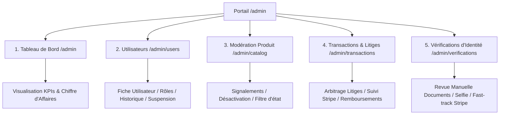
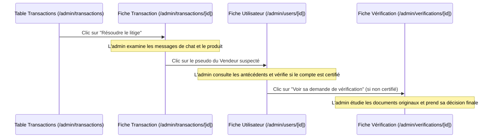

# 🛡️ Conception de l'Interface Administrateur — PlayAgain

Ce document rassemble les spécifications, la cartographie des fonctionnalités et l'architecture technique de la future **Interface Administrateur** de **PlayAgain**. C'est un document vivant destiné à être affiné pas-à-pas au cours de nos discussions.

---

## 🗺️ Vision d'Ensemble & Objectifs

L'interface d'administration `/admin` est le centre opérationnel de PlayAgain. Elle permet aux équipes internes de surveiller la santé de la plateforme, de modérer les contenus, de résoudre les conflits entre acheteurs et vendeurs, et de valider les demandes de certification d'identité.

### Les 3 Piliers de l'Administration :
1. **Confiance & Sécurité :** Traiter les demandes de vérification d'identité, auditer les comptes bancaires Stripe Connect (KYC) et bannir les utilisateurs malveillants.
2. **Modération du Catalogue :** Valider, signaler ou retirer les fiches de produits de sport d'occasion non conformes.
3. **Médiation Financière (Litiges) :** Intervenir sur les transactions signalées comme litigieuses, suspendre les fonds, et arbitrer les remboursements ou la libération des paiements (séquestre).

---

## 🧭 Cartographie des Modules & Navigation (Sitemap)

Pour offrir une expérience de gestion fluide et efficace, l'interface administrateur est divisée en **5 grands modules** accessibles via une barre latérale rétractable et persistante.



---

## 🏗️ Architecture des Dossiers & Routage Next.js (App Router)

Pour intégrer ces modules dans le projet Next.js actuel sans créer de conflits avec la partie publique (boutique/shop) de PlayAgain, voici l'architecture de routage proposée.

### 1. Isolation du Layout Global (Shop vs Admin)
Comme nous l'avons vu dans le fichier [layout.tsx de la racine](file:///home/chab/GIT/PlayAgain/play-again/app/layout.tsx), des composants comme `<MobileNavbar />` et `<Footer />` sont inclus globalement. Dans un espace d'administration professionnel, ces composants perturbent l'ergonomie et doivent être masqués ou isolés.

Nous avons **deux méthodes** pour y parvenir :

*   **Méthode A : Structuration par Route Groups (Recommandée & Standard Next.js)**
    On sépare physiquement l'application en deux groupes de routes au sein du dossier `/app` :
    *   `/app/(shop)/...` : Contient toutes les pages publiques (shop, sell, profile, help, etc.) et possède son propre `layout.tsx` incluant le `<Footer />` et la `<MobileNavbar />`.
    *   `/app/(admin)/admin/...` : Contient l'espace administrateur et possède son propre `layout.tsx` spécifique avec la Sidebar administrative, sans les composants de la boutique.
*   **Méthode B : Masquage Conditionnel (Sans déplacement de fichiers)**
    Si l'on ne souhaite pas réorganiser l'arborescence des fichiers existants, on modifie simplement le layout racine `/app/layout.tsx` pour masquer les composants utilisateurs s'ils commencent par `/admin` :
    ```tsx
    // Exemple d'utilisation dans layout.tsx
    const isReady = true; // ...
    const isAdminRoute = pathname?.startsWith('/admin');
    
    return (
      // ...
      {!isAdminRoute && <Footer />}
      {!isAdminRoute && <MobileNavbar />}
      // ...
    )
    ```

### 2. Structure Exacte des Fichiers proposée sous `/app`

Voici l'arborescence complète à créer pour supporter l'interface d'administration :

```text
/app
├── admin
│   ├── layout.tsx                       # Layout d'Administration (Sidebar + Topbar + Content Wrapper)
│   ├── page.tsx                         # 1. Tableau de bord (/admin)
│   │
│   ├── users
│   │   ├── page.tsx                     # 2. Liste des utilisateurs (/admin/users)
│   │   └── [id]
│   │       └── page.tsx                 # Fiche de détail et actions utilisateur (/admin/users/[id])
│   │
│   ├── catalog
│   │   ├── page.tsx                     # 3. Modération du Catalogue (/admin/catalog)
│   │   └── [id]
│   │       └── page.tsx                 # Fiche détaillée de modération produit (/admin/catalog/[id])
│   │
│   ├── transactions
│   │   ├── page.tsx                     # 4. Liste des factures & litiges (/admin/transactions)
│   │   └── [id]
│   │       └── page.tsx                 # Fiche de transaction & arbitrage de litige (/admin/transactions/[id])
│   │
│   └── verifications
│       ├── page.tsx                     # 5. Liste des demandes de vérification d'identité (/admin/verifications)
│       └── [id]
│           └── page.tsx                 # Écran de revue de pièces d'identité & selfie (/admin/verifications/[id])
```

---

## 🎛️ Conception du Layout d'Administration (`/app/admin/layout.tsx`)

Le layout principal entoure chaque page d'administration. Il se compose d'une structure en grilles (CSS Grid/Flexbox) moderne et adaptative :

```text
+-----------------------------------------------------------------------------------+
|  [LOGO PLAYAGAIN] [ADMIN]  |  Topbar : Breadcrumbs > Utilisateurs > Jean Dupont    |
|  ------------------------  |  Search... [Recherche Globale]   (Profil Admin v)    |
|  (v) Dashboard             +------------------------------------------------------+
|  (v) Utilisateurs          |                                                      |
|  (v) Catalogue             |                                                      |
|  (v) Transactions  [Litige]|              ZONE DE CONTENU DE LA PAGE              |
|  (v) Vérifications [Pending|              (Défilement vertical indépendant)       |
|                            |                                                      |
|                            |                                                      |
|  [Quitter l'Admin]         |                                                      |
+----------------------------+------------------------------------------------------+
```

### 1. La Sidebar (Barre Latérale Persistante) — Côté Gauche
*   **Identité de la Marque :** Logo original de PlayAgain complété d'un badge néon `"ADMIN"` clignotant ou rétroéclairé.
*   **Informations Session Administrateur :** Un bloc compact affichant la photo de l'admin connecté, son prénom et un tag `SuperAdmin` ou `Modérateur`.
*   **Liens de Navigation Actifs :**
    *   **Tableau de bord :** Icône de graphe de performances.
    *   **Utilisateurs :** Icône de double profil.
    *   **Catalogue :** Icône de boîte de sport ou de ballon.
    *   **Transactions :** Icône de carte de crédit. *En bonus : un mini-badge indicateur rouge `"!"` s'affiche si un litige est actif.*
    *   **Vérifications :** Icône de carte d'identité ou de badge coché. *En bonus : un badge vert affichant le nombre de requêtes `PENDING` en temps réel (ex. `3`)*.
*   **Bouton de Retour au Site :** Placé tout en bas de la sidebar, il permet à l'administrateur de repasser sur la boutique utilisateur d'un seul clic.

### 2. La Topbar (Barre Supérieure) — Côté Droit
*   **Breadcrumbs (Fil d'Ariane) :** Permet à l'admin de s'orienter instantanément (ex: `Administration` > `Transactions` > `Commande #4102`).
*   **Moteur de Recherche Global Rapide :** Un champ de recherche universel qui, via des raccourcis clavier (ex: `Cmd+K`), permet de chercher un utilisateur par email, un produit par nom, ou une transaction par son ID de paiement Stripe.
*   **Menu Profil & Déconnexion :** Un menu déroulant pour gérer ses propres paramètres admin et se déconnecter de la session NextAuth.

---

## 🔗 Cartographie de l'Interconnexion des Pages (L'Ergonomie de Productivité)

Dans une interface de gestion, l'administrateur doit pouvoir sauter d'une entité à une autre sans avoir à faire marche arrière ou à copier-coller des identifiants. Nous concevons les liens pour qu'ils forment un réseau interconnecté hyper-fluide :

### Scénario 1 : Traitement d'un Litige Financier


### Scénario 2 : Modération d'un Signalement Produit
1.  L'administrateur est sur la liste de modération du catalogue (`/admin/catalog`).
2.  Il voit un produit signalé comme "Contrefaçon".
3.  Il clique sur **"Voir le Produit"** -> ouverture de la fiche produit admin (`/admin/catalog/[id]`).
4.  Sur cette fiche, un lien direct vers le **vendeur** (`/admin/users/[vendeur_id]`) lui permet de voir si ce vendeur a d'autres annonces suspectes.
5.  Depuis la fiche du vendeur, l'admin peut décider de :
    *   Désactiver le produit.
    *   Suspendre le compte du vendeur en un clic.
    *   Lui envoyer une notification d'avertissement automatique.

---

## 📦 Spécifications Détaillées des 11 Modules (UI/UX, Prisma & APIs)


---

### 1. Le Tableau de Bord Général (`/admin`)

#### A. Rôle & Expérience Utilisateur (UI/UX)
L'accueil de l'administrateur projette la santé en direct de la plateforme avec une esthétique premium de salle de contrôle :
*   **Les Cartes de KPIs (KPI Glassmorphic Cards) :** Cartes translucides avec contours phosphorescents. Au survol, de subtils gradients s'illuminent.
    *   *Volume d'Affaires (GMV) :* Chiffre d'affaires brut consolidé.
    *   *Commissions Net :* Bénéfice réel calculé après déduction des frais Stripe.
    *   *Taux de conversion global :* Ratio paniers validés / visites.
    *   *Alertes Critiques :* Un compteur rouge clignotant affichant la somme : `Vérifications en attente + Litiges actifs + Colis en anomalie`.
*   **Graphe Dynamique d'Activité :** Courbe interactive (Chart.js ou Recharts) en tons émeraude et bleu néon retraçant l'évolution quotidienne du chiffre d'affaires et du nombre de nouvelles annonces.
*   **Journal des Activités (Audit feed) :** Flux vertical déroulant montrant en temps réel les dernières actions des administrateurs et des processus automatisés de l'IA.

#### B. Requêtes Base de Données (Prisma)
Calcul des KPIs financiers et de volume :
```typescript
// Récupérer le GMV et les commissions sur les 30 derniers jours
const startDate = new Date();
startDate.setDate(startDate.getDate() - 30);

const invoices = await prisma.invoice.findMany({
  where: {
    invoice_date: { gte: startDate },
    status: { in: ['PAID', 'SHIPPED', 'DELIVERED', 'COMPLETED'] }
  },
  select: { total_price: true, commission: true }
});

const gmv = invoices.reduce((sum, inv) => sum + Number(inv.total_price), 0);
const netCommission = invoices.reduce((sum, inv) => sum + Number(inv.commission || 0), 0);
```

#### C. Spécifications API Next.js
*   **Route :** `GET /api/admin/dashboard/stats`
*   **Rôle :** Retourner les métriques consolidées du dashboard.
*   **Réponse (JSON) :**
    ```json
    {
      "gmv": 14205.50,
      "commission": 710.25,
      "activeUsers": 1245,
      "alertsCount": {
        "disputes": 3,
        "verifications": 5,
        "shippingAnomalies": 2
      }
    }
    ```

#### D. Identité Visuelle & Stylisation Premium (Tailwind & CSS)
*   **Structure de la Grille :** Grid de 4 colonnes sur écran large (`grid grid-cols-1 md:grid-cols-4 gap-6`) s'empilant sur mobile.
*   **Effet de Verre (Glassmorphic Cards) :**
    *   Classe Tailwind : `bg-white/[0.03] backdrop-blur-xl border border-white/[0.08] rounded-2xl p-6 shadow-2xl transition-all duration-300 hover:border-emerald-500/30 hover:shadow-[0_0_25px_rgba(16,185,129,0.1)]`
*   **Graphique (Recharts Canvas) :** Conteneur avec dégradé linéaire (`bg-gradient-to-b from-[#111827] to-[#0B0F19]`). La ligne du graphique utilise un dégradé de couleur néon vert émeraude (`#10B981`) vers le bleu cyber (`#3B82F6`) avec un effet de flou en fond (drop-shadow CSS).
*   **Le Badge d'Alerte Flash (Clignotement) :**
    *   Bouton clignotant rouge utilisant l'animation `animate-pulse` de Tailwind combinée avec une lueur radiale `shadow-[0_0_15px_rgba(239,68,68,0.5)]` pour avertir l'administrateur sans créer de pollution visuelle.

---

### 2. Gestion des Utilisateurs (`/admin/users`)

#### A. Rôle & Expérience Utilisateur (UI/UX)
*   **Tableau de Données Avancé (Data Table) :** Liste paginée avec recherche en temps réel et filtres instantanés.
*   **Fiche Profil Admin :** Volet latéral (Drawer) s'ouvrant en glissant depuis le bord droit pour afficher le profil détaillé sans quitter le tableau.
*   **Bouton d'Action Soft-Delete :** Un bouton rouge arborant l'icône de suspension. Au clic, une boîte de dialogue demande confirmation avec saisie obligatoire du motif de désactivation.

#### B. Logique Métier & Requêtes Prisma (Soft-Delete)
La suppression d'un compte ne doit jamais être physique (`DELETE`) pour ne pas corrompre les clés étrangères des tables `Invoice`, `Message`, et `Address`.
```typescript
// Soft-Delete d'un utilisateur et désactivation en cascade de ses annonces en cours
const userId = 42;
const reason = "Suspicion d'escroquerie et refus de vérification";

await prisma.$transaction([
  // 1. Désactiver l'utilisateur
  prisma.user.update({
    where: { id: userId },
    data: { is_active: false }
  }),
  // 2. Désactiver toutes ses annonces en cours
  prisma.product.updateMany({
    where: { user_id: userId, is_sold: false },
    data: { is_active: false }
  }),
  // 3. Logguer l'action dans le journal d'audit
  prisma.adminLog.create({
    data: {
      adminId: currentAdminId,
      action: "USER_SOFT_DELETE",
      targetId: userId,
      metadata: { reason }
    }
  })
]);
```

#### C. Spécifications API Next.js
*   **Route :** `DELETE /api/admin/users/[id]`
*   **Payload (JSON) :**
    ```json
    { "reason": "Motif officiel de suspension" }
    ```
*   **Réponse (JSON) :**
    ```json
    { "success": true, "message": "L'utilisateur a été désactivé et ses annonces masquées." }
    ```

#### D. Identité Visuelle & Stylisation Premium (Tailwind & CSS)
*   **Tableau Modifiable (Cyber Table) :** Les lignes du tableau ont des séparateurs minces (`border-white/[0.04]`). 
    *   Effet de survol sur la ligne : `hover:bg-white/[0.02] transition-colors duration-200`.
*   **Bouton Soft-Delete (Danger Button) :**
    *   Design : Bordure rouge corail satinée avec icône.
    *   Classes : `border border-red-500/20 bg-red-500/10 text-red-400 hover:bg-red-500/20 hover:text-white rounded-lg px-3 py-1.5 transition-all text-xs font-semibold hover:shadow-[0_0_10px_rgba(239,68,68,0.2)]`.
*   **Le volet coulissant (Drawer) :**
    *   Structure : `fixed right-0 top-0 h-full w-[450px] bg-[#0E1322] border-l border-white/[0.08] shadow-[-10px_0_30px_rgba(0,0,0,0.5)] z-50 transition-transform duration-300 ease-out`.
    *   Un fond de flou d'arrière-plan (`bg-black/40 backdrop-blur-sm`) couvre le reste de l'écran pour focaliser l'attention sur la fiche ouverte.

---

### 3. Modération du Catalogue (`/admin/catalog`)

#### A. Rôle & Expérience Utilisateur (UI/UX)
*   **Galerie de Modération :** Affiche sous forme de cartes visuelles les annonces signalées ou suspectes. Un indicateur coloré montre le degré de gravité du signalement (Vert = Faible, Orange = Modéré, Rouge = Contrefaçon / Arnaque).
*   **Visualisateur Zoom-Image :** Un survol de l'image de l'article de sport affiche un zoom haute résolution instantané pour examiner l'usure ou les logos de marque.
*   **Curseur d'Actions :** Accès immédiat pour valider (retirer le signalement), demander correction à l'utilisateur (envoie un formulaire pré-rempli) ou désactiver l'annonce.

#### B. Logique Métier & Requêtes Prisma (Soft-Delete Annonce)
Le Soft-Delete d'un produit passe le booléen `is_active` à `false`. Cela évite les plantages sur les transactions passées et les paniers actifs.
```typescript
// Soft-delete d'un produit
const productId = 789;

await prisma.product.update({
  where: { id: productId },
  data: { is_active: false }
});
```

#### C. Spécifications API Next.js
*   **Route :** `DELETE /api/admin/catalog/[id]`
*   **Payload (JSON) :**
    ```json
    { "reason": "Contrefaçon avérée de raquette de tennis" }
    ```
*   **Réponse (JSON) :**
    ```json
    { "success": true, "message": "Annonce de produit désactivée avec succès." }
    ```

#### D. Identité Visuelle & Stylisation Premium (Tailwind & CSS)
*   **La grille de produits (Masonry or CSS Grid) :** `grid grid-cols-1 sm:grid-cols-2 lg:grid-cols-3 gap-6`.
*   **L'effet Zoom sur les images produit :**
    *   Conteneur : `overflow-hidden rounded-t-xl relative aspect-square bg-gray-900`.
    *   Image : `transition-transform duration-500 ease-in-out hover:scale-110 object-cover w-full h-full`.
*   **Badges de Signalement (Glow Badges) :**
    *   *Vert (Faible) :* `bg-emerald-500/10 text-emerald-400 border border-emerald-500/20`
    *   *Orange (Moyen) :* `bg-amber-500/10 text-amber-400 border border-amber-500/20`
    *   *Rouge (Grave) :* `bg-red-500/10 text-red-400 border border-red-500/20 shadow-[0_0_12px_rgba(239,68,68,0.15)]`
    *   Style : Forme arrondie de type pilule, typographie majuscule compacte (`text-[10px] tracking-wider font-extrabold`).

---

### 4. Transactions & Arbitrage de Litiges (`/admin/transactions`)

#### A. Rôle & Expérience Utilisateur (UI/UX)
Ce module est le centre de gestion financière sous séquestre Stripe.
*   **Écran de Résolution de Litige (Dispute Center) :**
    *   *Haut de page :* Timeline de la transaction (Date d'achat ➔ Expédition ➔ Date de déclaration de litige).
    *   *Gauche :* La fiche de commande (Article, prix, vendeur, acheteur) et le chat de discussion complet de la transaction.
    *   *Droite :* Zone d'examen des preuves. L'acheteur charge les photos du défaut, l'admin compare avec les photos initiales du vendeur.
*   **Boutons d'Arbitrage Majeurs (Stripe Escrow Triggers) :**
    *   *Bouton Émeraude "Payer le Vendeur" :* Débloque les fonds séquestrés.
    *   *Bouton Corail "Rembourser l'Acheteur" :* Annule la transaction et retourne l'argent à l'acheteur.

#### B. Logique Métier & Requêtes Prisma (Remboursement / Libération)
```typescript
// Arbitrage Litige - Option 1 : Remboursement de l'acheteur
const invoiceId = 102;

await prisma.$transaction([
  // 1. Passer le statut de la facture à CANCELLED (Annulée) et libérer le litige
  prisma.invoice.update({
    where: { id: invoiceId },
    data: {
      status: "CANCELLED",
      is_disputed: false
    }
  }),
  // 2. Repasser le produit à la vente (si l'objet est retourné) ou le bloquer
  prisma.product.update({
    where: { id: associatedProductId },
    data: { is_sold: false, is_active: true }
  })
]);
// (Next.js déclenche en parallèle l'appel Stripe : stripe.refunds.create({ payment_intent: paymentIntentId }))
```

#### C. Spécifications API Next.js
*   **Route :** `POST /api/admin/transactions/[id]/arbitrate`
*   **Payload (JSON) :**
    ```json
    {
      "decision": "REFUND_BUYER", // ou "PAY_SELLER"
      "reason": "Colis reçu endommagé sans protection adéquate"
    }
    ```
*   **Réponse (JSON) :**
    ```json
    { "success": true, "refundId": "re_3Myn2B...", "status": "CANCELLED" }
    ```

#### D. Identité Visuelle & Stylisation Premium (Tailwind & CSS)
*   **Mise en page Split-Screen :** Sur desktop, deux colonnes équilibrées (`grid grid-cols-1 lg:grid-cols-2 gap-8 h-[calc(100vh-120px)]`).
*   **Le Fil de Discussion de Commande (Premium Chat Bubble) :**
    *   Bulles Acheteur : `bg-white/[0.04] text-white border border-white/[0.06] rounded-br-none` (aligné à droite).
    *   Bulles Vendeur : `bg-[#1E293B] text-slate-200 border border-slate-700/50 rounded-bl-none` (aligné à gauche).
    *   Bulles d'informations système : `bg-blue-500/10 text-blue-400 border border-blue-500/20 text-center mx-auto text-xs py-1 px-3 rounded-full my-4 max-w-[80%]`.
*   **Bouton d'Arbitrage Escrow :**
    *   Bouton "Payer le Vendeur" : `bg-emerald-500 hover:bg-emerald-600 active:scale-95 text-white font-bold py-3 px-6 rounded-xl transition-all shadow-[0_4px_15px_rgba(16,185,129,0.3)]`.

---

### 5. Vérification d'Identité (`/admin/verifications`)

#### A. Rôle & Expérience Utilisateur (UI/UX)
Directement interconnecté avec [verification_manual_ai_plan.md](file:///home/chab/GIT/PlayAgain/conceptionPlayAgain/verification_manual_ai_plan.md).
*   **Visualisateur d'Identité Synchrone :**
    *   Affiche en plein écran côte à côte :
        1. La pièce d'identité (Recto / Verso).
        2. Le Selfie manuscrit tenant le mot écrit *"Play Again"*.
    *   *Commandes d'examen :* Boutons de rotation à 90° (les utilisateurs prennent souvent leurs pièces d'identité de côté), filtres de netteté CSS, réglage de contraste, et zoom dynamique contrôlé à la molette.
*   **Tableau de Concordance textuelle :** Surligne en vert les correspondances exactes (Nom, prénom, adresse postale) entre les documents officiels et les informations de profil de l'utilisateur.

#### B. Logique Métier & Requêtes Prisma (Approbation)
```typescript
// Valider une demande d'identité et attribuer le badge de certification
const requestId = 8;
const userId = 24;

await prisma.$transaction([
  // 1. Approuver la requête de vérification
  prisma.verificationRequest.update({
    where: { id: requestId },
    data: {
      status: "APPROVED",
      reviewedById: currentAdminId,
      reviewedAt: new Date()
    }
  }),
  // 2. Activer le statut certifié sur l'utilisateur
  prisma.user.update({
    where: { id: userId },
    data: { is_certified: true }
  })
]);
```

#### C. Spécifications API Next.js
*   **Route :** `POST /api/admin/verifications/[id]/resolve`
*   **Payload (JSON) :**
    ```json
    {
      "status": "APPROVED", // ou "REJECTED"
      "rejectionReason": null // Saisi en cas de rejet (ex: "Selfie illisible")
    }
    ```
*   **Réponse (JSON) :**
    ```json
    { "success": true, "isCertified": true }
    ```

#### D. Identité Visuelle & Stylisation Premium (Tailwind & CSS)
*   **Liseuse de Documents (Lightbox) :** Fond noir absolu (`bg-black/95`) avec structure en flexbox pour centrer les fichiers.
*   **Contrôles Interactifs de l'Image (Filtres CSS en ligne) :**
    *   L'image possède des styles dynamiques reliés à des états React :
        `style={{ transform: `rotate(${rotation}deg) scale(${zoom})`, filter: `brightness(${brightness}%) contrast(${contrast}%)` }}`.
    *   Classe Tailwind de l'image de pièce d'identité : `border border-white/10 rounded-lg max-h-[70vh] transition-transform duration-200 cursor-grab active:cursor-grabbing`.
*   **Badge Stripe KYC Fast-Track :**
    *   Glow Violet Stripe : `bg-[#635BFF]/10 text-[#8F88FF] border border-[#635BFF]/30 font-bold px-3 py-1 rounded-full shadow-[0_0_15px_rgba(99,91,255,0.2)] animate-pulse`.

---

### 6. Notifications Globales & Sondages Interactifs (`/admin/notifications`)

#### A. Rôle & Expérience Utilisateur (UI/UX)
*   **L'Éditeur de Message Riche :** Formulaire glassmorphism complet avec prévisualisation en temps réel sous format mobile/desktop à droite de l'écran. Permet d'insérer du gras, des listes, et d'uploader une image de couverture.
*   **Le Configurateur de Sondage :** L'admin définit une question (ex: *"Quel sport d'été pratiquez-vous le plus ?"*) et crée de 2 à 4 options.
*   **Graphe des Résultats Live :** Un anneau (Doughnut Chart) s'anime et se met à jour par flux de données (WebSockets ou rafraîchissement régulier) au fur et à mesure que les membres votent depuis leur application.

#### B. Logique Métier & Requêtes Prisma
Nous devons être capables de lister les résultats cumulés d'un sondage stocké dans la table `Notification` (les réponses des utilisateurs sont enregistrées dans un format JSON sur leur profil ou une table d'association).
```typescript
// Récupérer et regrouper les votes pour un sondage spécifique
const pollId = 15;
const notifications = await prisma.notification.findMany({
  where: { type: "POLL", id: pollId },
  select: { metadata: true }
});

// Compilation des réponses (ex: { "football": 420, "tennis": 210 })
const results: Record<string, number> = {};
notifications.forEach(notif => {
  const vote = (notif.metadata as any)?.userVote;
  if (vote) {
    results[vote] = (results[vote] || 0) + 1;
  }
});
```

#### C. Spécifications API Next.js
*   **Route :** `POST /api/admin/notifications/global`
*   **Payload (JSON) :**
    ```json
    {
      "type": "POLL", // ou "ANNOUNCEMENT"
      "message": "Nouveau sondage de saison !",
      "metadata": {
        "question": "Votre sport de raquette préféré ?",
        "options": ["Tennis", "Padel", "Squash", "Badminton"]
      }
    }
    ```
*   **Réponse (JSON) :**
    ```json
    { "success": true, "notifiedUsers": 12450 }
    ```

#### D. Identité Visuelle & Stylisation Premium (Tailwind & CSS)
*   **Mise en page de l'éditeur (Split Form/Preview) :** Deux colonnes asymétriques (`grid grid-cols-1 xl:grid-cols-5 gap-8`). Formulaire sur 3 colonnes, aperçu sur 2 colonnes.
*   **Maquette de Téléphone d'Aperçu (Mobile Mockup Container) :**
    *   Cadre réaliste en CSS ressemblant à un iPhone : `border-[8px] border-slate-800 rounded-[32px] h-[550px] w-[270px] bg-[#0F172A] relative shadow-2xl mx-auto overflow-hidden`.
    *   Haut-parleur virtuel : `absolute top-3 left-1/2 transform -translate-x-1/2 h-4 w-20 bg-slate-800 rounded-full z-20`.
    *   Contenu interne simulé avec des transitions CSS lors de la frappe de l'administrateur dans l'éditeur.

---

### 7. Gestion de la Taxonomie, des Marques et des Expertises IA (`/admin/taxonomy`)

#### A. Rôle & Expérience Utilisateur (UI/UX)
*   **Table des Marques Provisoires :** Liste les marques inédites saisies par les utilisateurs lors de la publication de leurs annonces.
*   **Outil de Fusion-Marque (Merge Tool) :** Au clic sur une marque provisoire (ex: *"Nikee"*), l'admin peut taper *"Nike"* dans une barre de recherche intelligente. Un bouton `"Fusionner et corriger les annonces"` réassocie toutes les fiches produits vers la marque correcte officielle et supprime le doublon.
*   **Console d'Expertise IA & Affinage Manuel (AI Calibrator) :** Affiche les règles prédictives générées par l'IA dans la table `BrandExpertise`. L'admin peut ajuster la technicité (le `level`), la gamme (`rangeName`) et fixer la confiance à `1.0` pour empêcher l'algorithme d'IA d'altérer à nouveau cette règle.
*   **Création de Règle d'Expertise IA (Manual Rule Injector) :** Un formulaire dédié permet à l'administrateur de **créer proactivement une règle d'apprentissage** pour l'IA :
    *   *Saisie de la Marque & Catégorie :* Sélection d'une marque officielle et d'une catégorie de sport.
    *   *Mots-Clés et Modèle (Gamme) :* Définir le motif ou le mot-clé exact recherché dans le titre/description (ex: *"AeroPro Drive"*).
    *   *Classification Forcée :* Assigner le niveau technique ciblé (BEGINNER, INTERMEDIATE, ADVANCED, PRO) et la gamme associée.
    *   *Verrouillage Immédiat :* La règle est enregistrée directement avec une confiance de `1.0` (ce qui la rend prioritaire sur toute prédiction automatique future de l'IA).

#### B. Logique Métier & Requêtes Prisma (Fusion & Création de Règle IA)
```typescript
// 1. Fusionner une marque provisoire mal orthographiée vers la marque principale
const provisionalBrandId = 12; // ID de "Nikee"
const targetBrandId = 2; // ID de "Nike"

await prisma.$transaction([
  prisma.product.updateMany({
    where: { brand_id: provisionalBrandId },
    data: { brand_id: targetBrandId }
  }),
  prisma.brand.delete({
    where: { id: provisionalBrandId }
  })
]);

// 2. Création ou mise à jour forcée d'une règle d'expertise IA manuelle (BrandExpertise)
const newRule = {
  brandId: 3,        // Babolat
  categoryId: 5,     // Tennis
  modelName: "AeroPro Drive",
  sportLevel: "ADVANCED",
  rangeName: "PURE_AERO"
};

await prisma.brandExpertise.upsert({
  where: {
    // Clé unique composite ou recherche par marque, catégorie et modèle exact
    brandId_categoryId_modelName: {
      brandId: newRule.brandId,
      categoryId: newRule.categoryId,
      modelName: newRule.modelName
    }
  },
  update: {
    level: newRule.sportLevel,
    rangeName: newRule.rangeName,
    confidence: 1.0 // Verrouillage manuel à 1.0 (verrou administratif)
  },
  create: {
    brandId: newRule.brandId,
    categoryId: newRule.categoryId,
    modelName: newRule.modelName,
    level: newRule.sportLevel,
    rangeName: newRule.rangeName,
    confidence: 1.0
  }
});
```

#### C. Spécifications API Next.js
*   **Route de Fusion :** `POST /api/admin/taxonomy/brands/merge`
*   **Payload Fusion (JSON) :**
    ```json
    { "provisionalBrandId": 12, "targetBrandId": 2 }
    ```
*   **Route de Création de Règle IA :** `POST /api/admin/taxonomy/rules`
*   **Payload Création Règle (JSON) :**
    ```json
    {
      "brandId": 3,
      "categoryId": 5,
      "modelName": "AeroPro Drive",
      "level": "ADVANCED",
      "rangeName": "PURE_AERO"
    }
    ```
*   **Réponse Règle (JSON) :**
    ```json
    { "success": true, "ruleId": 88, "confidence": 1.0, "message": "Règle IA injectée et verrouillée avec succès." }
    ```

#### D. Identité Visuelle & Stylisation Premium (Tailwind & CSS)
*   **Curseurs de Confiance IA (AI Confidence Bar) :**
    *   Une jauge horizontale représente la certitude de l'IA (ex: 85%).
    *   *Rendu visuel :* Barre de progression mince avec couleur dynamique :
        *   Confiance < 50% : `bg-red-500 shadow-[0_0_8px_rgba(239,68,68,0.4)]`
        *   Confiance entre 50% et 80% : `bg-amber-500 shadow-[0_0_8px_rgba(245,158,11,0.4)]`
        *   Confiance > 80% : `bg-emerald-500 shadow-[0_0_8px_rgba(16,185,129,0.4)]`
*   **Formulaire de Règle IA (Cyber Form Input) :**
    *   Le panneau de création manuelle est doté de listes déroulantes stylisées en verre foncé (`bg-[#0B0F19] text-white border border-white/[0.08] rounded-xl focus:border-[#10B981] focus:ring-2 focus:ring-[#10B981]/20`).
*   **Le Badge IA "Locked" (Verrouillé par l'admin) :** Un badge affichant une icône de cadenas fermé en or brillant (`text-yellow-400 drop-shadow-[0_0_4px_rgba(234,179,8,0.3)]`) s'active dès que l'expertise possède une confiance réglée à `1.0`.


---

### 8. Configuration des Commissions & Paramètres Financiers (`/admin/finance-config`)

#### A. Rôle & Expérience Utilisateur (UI/UX)
*   **Curseurs de Frais (Sliders) :** Permet de modifier d'un glissement de doigt le pourcentage de commission et les frais fixes de plateforme.
*   **Zone d'Aperçu Prévisionnel (Pricing Simulator) :** Un simulateur de tarification interactif montre instantanément à l'admin l'impact de ses modifications sur une vente moyenne (ex: Raquette de tennis d'occasion vendue 100€).
*   **Historique des versions :** Liste des modifications de taux avec signature de l'administrateur ayant appliqué le changement.

#### B. Requêtes Base de Données (Prisma)
Puisque le schéma Prisma ne comporte pas de table de configuration globale, nous créons ou exploitons une table d'options / métadonnées (ou un fichier de configuration dynamique en base via un format clé-valeur JSON).
```typescript
// Enregistrer la nouvelle règle de commission en base de données
const newCommissionRate = 5.0; // 5%
const transactionFee = 0.99;  // 0.99€ fixe

// Recherche ou création d'une ligne d'option système
await prisma.systemConfig.upsert({
  where: { key: "FINANCE_FEE_RULES" },
  update: { value: JSON.stringify({ commissionRate: newCommissionRate, flatFee: transactionFee }) },
  create: { key: "FINANCE_FEE_RULES", value: JSON.stringify({ commissionRate: newCommissionRate, flatFee: transactionFee }) }
});
```

#### C. Spécifications API Next.js
*   **Route :** `POST /api/admin/config/fees`
*   **Payload (JSON) :**
    ```json
    { "commissionRate": 5.0, "flatFee": 0.99 }
    ```
*   **Réponse (JSON) :**
    ```json
    { "success": true, "updatedAt": "2026-05-30T13:10:00Z" }
    ```

#### D. Identité Visuelle & Stylisation Premium (Tailwind & CSS)
*   **Les Curseurs de Prix (Sleek Input Sliders) :**
    *   Composant HTML `<input type="range" />` personnalisé en CSS pour supprimer l'apparence par défaut et le remplacer par une ligne bleu néon avec une pastille émeraude de réglage qui s'agrandit légèrement lors du glissement.
    *   Classes CSS : `appearance-none h-1.5 w-full bg-white/10 rounded-lg cursor-pointer accent-[#10B981] hover:accent-[#059669]`.
*   **Panneau Prévisionnel de Vente (Pricing Grid) :**
    *   Affichage en grand format de la somme perçue par PlayAgain sous forme de nombre géant en dégradé de texte vert et blanc (`text-5xl font-extrabold bg-clip-text text-transparent bg-gradient-to-r from-white to-[#10B981]`).

---

### 9. Détection de Fraude & Corrélations Multi-comptes (`/admin/fraud`)

#### A. Rôle & Expérience Utilisateur (UI/UX)
*   **Graphe des Liaisons (Fraud Network Graph) :** Une représentation visuelle interactive en bulles (avec des liens colorés) montre comment plusieurs comptes d'utilisateurs apparemment différents sont interconnectés.
*   **Filtres de Corrélation :** L'admin peut sélectionner des filtres :
    *   🟢 *Même adresse IP* (Empreinte réseau).
    *   🟣 *Même compte Stripe Express* (IBAN identique).
    *   🟡 *Même numéro de téléphone*.
*   **Bouton d'Action Mass-Block :** Permet de suspendre en un clic la totalité du réseau suspect identifié.

#### B. Logique Métier & Requêtes Prisma (Recherche de doublons d'IBAN Stripe)
```typescript
// Trouver tous les utilisateurs partageant le même stripeConnectId
const duplicatedSellers = await prisma.user.findMany({
  where: {
    stripeConnectId: { not: null }
  },
  select: {
    id: true,
    email: true,
    stripeConnectId: true
  }
});

// Algorithme de détection de collision
const groups = duplicatedSellers.reduce((acc, user) => {
  const id = user.stripeConnectId!;
  if (!acc[id]) acc[id] = [];
  acc[id].push(user);
  return acc;
}, {} as Record<string, typeof duplicatedSellers>);

const suspiciousMatches = Object.values(groups).filter(group => group.length > 1);
```

#### C. Spécifications API Next.js
*   **Route :** `GET /api/admin/fraud/correlations`
*   **Réponse (JSON) :**
    ```json
    [
      {
        "type": "STRIPE_IBAN_COLLISION",
        "stripeConnectId": "acct_103M2y...",
        "users": [
          { "id": 14, "email": "arnaque1@gmail.com" },
          { "id": 88, "email": "fraudeur2@gmail.com" }
        ]
      }
    ]
    ```

#### D. Identité Visuelle & Stylisation Premium (Tailwind & CSS)
*   **Zone Canvas du Graphe de Réseau (Fraud Graph Canvas) :** Conteneur de dessin (`<canvas>` ou SVG) de type radar. 
    *   *Design :* Fond bleu nuit profond (`bg-[#070A13]`), quadrillage cybernétique fin (`bg-[linear-gradient(rgba(255,255,255,0.03)_1px,transparent_1px),linear-gradient(90deg,rgba(255,255,255,0.03)_1px,transparent_1px)] bg-[size:20px_20px]`).
*   **Noeuds de Réseau (Nodes Glow Effect) :**
    *   Les cercles représentant les utilisateurs suspects sont illuminés en rouge fluorescent (`shadow-[0_0_15px_#EF4444] border-2 border-red-500 bg-[#1A0B0E]`). Les lignes reliant les comptes clignotent doucement pour souligner la corrélation critique de données.

---

### 10. Supervision Logistique Active (`/admin/shipping`)

#### A. Rôle & Expérience Utilisateur (UI/UX)
*   **Tableau de Transit Actif :** Liste l'intégralité des envois en cours sous forme de lignes interactives avec des icônes d'états de livraison.
*   **Filtre d'Anomalie (Alert System) :** Isole instantanément les colis en retard ou suspects :
    *   *Statut : "Étiquette imprimée, non déposée depuis 5j"* (Couleur Orange).
    *   *Statut : "Bloqué en agence ou perdu"* (Couleur Rouge).
*   **Actions directes :** Un bouton permet d'envoyer un email d'avertissement automatique au vendeur pour accélérer le dépôt du colis ou de repousser la date de validation de la transaction.

#### B. Logique Métier & Requêtes Prisma
```typescript
// Récupérer toutes les factures (commandes) actives qui n'ont pas été livrées après 7 jours
const delayLimit = new Date();
delayLimit.setDate(delayLimit.getDate() - 7);

const delayedShippings = await prisma.invoice.findMany({
  where: {
    status: "SHIPPED",
    invoice_date: { lte: delayLimit }
  },
  include: {
    user: true // Informations sur l'acheteur
  }
});
```

#### C. Spécifications API Next.js
*   **Route :** `GET /api/admin/shipping/anomalies`
*   **Réponse (JSON) :**
    ```json
    [
      {
        "invoiceId": 4022,
        "trackingNumber": "MR-8830192A",
        "buyerEmail": "jean.acheteur@gmail.com",
        "daysSinceShipped": 9,
        "carrierStatus": "BLOCKED_IN_HUB"
      }
    ]
    ```

#### D. Identité Visuelle & Stylisation Premium (Tailwind & CSS)
*   **La Ligne Temporelle Logistique (Timeline Component) :**
    *   Une barre verticale ou horizontale grise parsemée d'étapes de livraison.
    *   Les étapes validées s'illuminent en vert émeraude (`bg-emerald-500 text-white shadow-[0_0_8px_rgba(16,185,129,0.5)]`).
    *   Les étapes en attente ou présentant des problèmes s'illuminent en rouge clignotant ou restent grises.
*   **Identité Logistique des Transporteurs :**
    *   *Badge Mondial Relay :* Couleur rose prune distinctive (`#BE185D` ou HSL `338, 87%, 41%`).
    *   *Badge Colissimo :* Couleur bleu outremer et jaune postale (`#1E3A8A` / `#F59E0B`).

---

### 11. Journalisation d'Audit Interne (`/admin/audit-logs`)

#### A. Rôle & Expérience Utilisateur (UI/UX)
*   **Table d'Audit Immuable :** Un tableau chronologique non modifiable listant l'intégralité des actions menées dans l'espace d'administration.
*   **Inspecteur JSON de métadonnées :** Au clic sur une ligne d'action, une liseuse de code élégante affiche le détail de la modification effectuée au format JSON (valeurs avant / après).
*   **Filtre par Modérateur :** Permet de surveiller et d'analyser le travail de chaque administrateur ou agent de support.

#### B. Schéma de Base de Données Prisma
Nous devrons ajouter ce modèle dans `schema.prisma` pour supporter la journalisation :
```prisma
model AdminLog {
  id         Int      @id @default(autoincrement())
  adminId    Int
  adminEmail String
  action     String   // ex: "USER_SOFT_DELETE", "LITIGE_RESOLVED"
  targetId   Int?     // ID de l'élément affecté (produit, utilisateur)
  metadata   Json?    // Contient le détail avant/après ou le motif de l'action
  ipAddress  String?
  createdAt  DateTime @default(now())
}
```

#### C. Spécifications API Next.js
*   **Route :** `GET /api/admin/audit-logs`
*   **Rendement (JSON) :**
    ```json
    [
      {
        "id": 142,
        "adminEmail": "moderateur1@playagain.fr",
        "action": "AI_CALIBRATION_OVERRIDE",
        "targetId": 839,
        "ipAddress": "192.168.1.42",
        "createdAt": "2026-05-30T13:12:00Z",
        "metadata": {
          "brand": "Wilson",
          "previousLevel": "BEGINNER",
          "newLevel": "ADVANCED"
        }
      }
    ]
    ```

#### D. Identité Visuelle & Stylisation Premium (Tailwind & CSS)
*   **Typographie Log Terminal (Console Font) :**
    *   L'ensemble du tableau et de la console d'audit utilise une police à chasse fixe moderne (`font-mono` en Tailwind, comme Fira Code ou JetBrains Mono).
*   **Visionneuse de code JSON (JSON Editor-Theme View) :**
    *   Un bloc stylisé avec barres de défilement douces.
    *   Classes CSS : `bg-[#030712] border border-white/5 rounded-xl p-4 overflow-auto text-xs text-emerald-400 font-mono shadow-inner max-w-full max-h-[300px]`.
    *   Mise en surbrillance syntaxique simple des clés JSON (`text-slate-400`) et des valeurs booléennes ou nombres (`text-amber-400`).

---

### 12. Moteur de Codes Promos & Campagnes Marketing (`/admin/marketing`)

#### A. Rôle & Expérience Utilisateur (UI/UX)
Ce module permet de booster l'activité commerciale en créant des codes de réduction ciblés ou globaux.
*   **Écran de Création de Coupon :** Formulaire permettant de configurer :
    *   *Code unique :* Saisie du code (ex: `TENNIS2026`).
    *   *Type de réduction :* Pourcentage (ex: -10% sur les frais) ou réduction fixe (ex: -5€ sur le panier).
    *   *Conditions :* Montant minimum d'achat, limite d'utilisations globales, date d'expiration.
*   **Bouton de Diffusion Massive (Glow Broadcast Trigger) :** A côté de chaque code promo créé, un bouton doré *"Diffuser l'offre massivement"* permet en un clic de déclencher l'envoi d'une notification in-app globale à tous les utilisateurs avec un bouton copiable pour appliquer automatiquement le code au checkout.

#### B. Logique Métier & Requêtes Prisma
```typescript
// 1. Enregistrement du nouveau code promo
const promoCode = await prisma.promoCode.create({
  data: {
    code: "PLAYTEN",
    discountPercent: 10,
    minBasketAmount: 50.0,
    isActive: true,
    expiresAt: new Date("2026-09-30")
  }
});

// 2. Diffusion massive (Création de notification pour tous les utilisateurs actifs)
const activeUsers = await prisma.user.findMany({
  where: { is_active: true },
  select: { id: true }
});

await prisma.notification.createMany({
  data: activeUsers.map(user => ({
    user_id: user.id,
    type: "PROMO_CODE",
    message: "Fêtez le tennis avec -10% sur vos achats avec le code PLAYTEN !",
    metadata: { promoCode: "PLAYTEN", discountPercent: 10 }
  }))
});
```

#### C. Spécifications API Next.js
*   **Route de Création :** `POST /api/admin/marketing/coupons`
*   **Payload (JSON) :**
    ```json
    {
      "code": "PLAYTEN",
      "discountPercent": 10,
      "minBasketAmount": 50.0,
      "expiresAt": "2026-09-30T23:59:59Z"
    }
    ```
*   **Route de Diffusion :** `POST /api/admin/marketing/coupons/[id]/broadcast`
*   **Réponse Diffusion (JSON) :**
    ```json
    { "success": true, "notifiedCount": 12450 }
    ```

#### D. Identité Visuelle & Stylisation Premium (Tailwind & CSS)
*   **Le Badge de Code Promo (Ticket Style) :**
    *   *Design :* Style ticket rétro-futuriste avec pointillés de découpe CSS sur les bords latéraux.
    *   *Classes :* `bg-gradient-to-r from-yellow-500/10 to-amber-500/10 border border-dashed border-amber-500/30 text-amber-300 font-mono font-extrabold text-lg px-4 py-2 rounded-lg relative overflow-hidden shadow-[0_0_15px_rgba(245,158,11,0.05)]`.
*   **Bouton de Diffusion (Golden Button) :**
    *   Classes : `bg-gradient-to-r from-yellow-500 to-amber-600 hover:from-yellow-400 hover:to-amber-500 active:scale-95 text-black font-extrabold px-4 py-2 rounded-xl transition-all shadow-[0_4px_15px_rgba(245,158,11,0.35)]`.

---

### 13. Centre de Support & Helpdesk (`/admin/support`)

#### A. Rôle & Expérience Utilisateur (UI/UX)
Connecté directement au module de support initié par les utilisateurs sur `/help` ou leur profil.
*   **Tableau de Gestion des Tickets (Admin Side) :** Affiche la liste des questions et réclamations envoyées par les membres.
*   **Console de Chat Support (Admin Side) :** L'admin voit la question de l'utilisateur, l'historique complet et dispose d'une zone de saisie pour rédiger sa réponse.
*   **Intégration Messagerie Permanente (User Side - Inbox Integration) :**
    *   *La Notification Fugace vs Le Fil Permanent :* Au lieu d'une simple notification temporaire que l'utilisateur risque d'effacer ou d'oublier, la réponse de l'admin **crée et alimente un fil de discussion permanent directement dans la messagerie personnelle de l'utilisateur** (au même titre que ses conversations d'achats/ventes).
    *   *L'identité "Support PlayAgain" :* Dans sa liste de discussions, le fil apparaît sous le nom de **"Support PlayAgain"** avec un avatar officiel émeraude et un badge certifié brillant.
    *   *Lecture Seule pour l'Utilisateur (Unidirectional Inbox) :* L'utilisateur peut ouvrir la conversation support dans sa messagerie pour consulter toutes les réponses passées de l'administrateur. Cependant, pour éviter l'engorgement et forcer le passage par le formulaire structuré d'aide, **l'utilisateur ne peut pas taper de réponse dans ce thread depuis sa messagerie**. La zone de texte habituelle de saisie est désactivée visuellement.

#### B. Logique Métier & Requêtes Prisma (Envoi de Réponse & Création de Fil dans la Messagerie)
Lors de l'envoi de la réponse, le serveur s'assure qu'un fil de discussion de support existe dans la messagerie de l'utilisateur (on utilise un flag `isSupportGroup` ou un utilisateur virtuel `SystemSupport` dans la table `Conversation`).
```typescript
// Répondre à un ticket de support utilisateur et l'injecter dans sa messagerie privée
const ticketId = 156;
const targetUserId = 42; // L'utilisateur ayant ouvert le ticket
const systemSupportUserId = 1; // ID de l'utilisateur virtuel représentant le Support Officiel
const adminReplyText = "Bonjour, après vérification, votre compte Stripe est validé. Vous pouvez dès maintenant retirer vos gains.";

await prisma.$transaction([
  // 1. Enregistrer le message dans la table support interne
  prisma.supportMessage.create({
    data: {
      ticketId: ticketId,
      senderId: currentAdminId,
      isAdminReply: true,
      content: adminReplyText
    }
  }),
  // 2. Mettre à jour le statut du ticket de support
  prisma.supportTicket.update({
    where: { id: ticketId },
    data: { status: "IN_PROGRESS", updatedAt: new Date() }
  }),
  // 3. Récupérer ou Créer la conversation système permanente dans la messagerie personnelle de l'utilisateur
  prisma.conversation.upsert({
    where: {
      // Clé unique composite ou recherche d'une conversation de type SUPPORT pour cet utilisateur
      userId_isSupportThread: {
        userId: targetUserId,
        isSupportThread: true
      }
    },
    update: {},
    create: {
      userId: targetUserId,
      isSupportThread: true,
      title: "Support PlayAgain"
    }
  }).then(async (conv) => {
    // 4. Injecter le message de l'admin directement dans ce fil de messagerie utilisateur
    await prisma.message.create({
      data: {
        conversationId: conv.id,
        senderId: systemSupportUserId, // Identifiant virtuel "Support"
        content: adminReplyText,
        isRead: false
      }
    });
  }),
  // 5. Envoyer une notification in-app d'alerte classique
  prisma.notification.create({
    data: {
      user_id: targetUserId,
      type: "SUPPORT_REPLY",
      message: "Le support PlayAgain vous a envoyé un message dans votre messagerie.",
      metadata: { ticketId: ticketId }
    }
  })
]);
```

#### C. Spécifications API Next.js
*   **Route d'envoi de réponse :** `POST /api/admin/support/tickets/[id]/reply`
*   **Payload (JSON) :**
    ```json
    {
      "content": "Bonjour, votre compte a été validé.",
      "targetUserId": 42
    }
    ```
*   **Réponse (JSON) :**
    ```json
    { "success": true, "messageInjectedInInbox": true, "status": "IN_PROGRESS" }
    ```

#### D. Identité Visuelle & Stylisation Premium (Tailwind & CSS)
*   **Affichage du thread dans la boîte de messagerie (User Side) :**
    *   *Design :* Fond de ligne légèrement bleuté pour le distinguer des autres messages.
    *   *Badge officiel :* `bg-emerald-500/10 text-emerald-400 border border-emerald-500/20 text-[9px] px-2 py-0.5 rounded-full font-bold ml-2 animate-pulse shadow-[0_0_8px_rgba(16,185,129,0.3)]`.
*   **La zone de saisie désactivée dans la messagerie utilisateur (User Side - Read-Only Input) :**
    *   *Visualisation :* Input grisé, non cliquable, avec icône de cadenas.
    *   *Classes CSS :* `bg-white/[0.01] border border-white/[0.04] text-slate-500 cursor-not-allowed select-none rounded-xl px-4 py-3 text-center text-xs font-semibold w-full`.
    *   *Texte explicatif à l'intérieur :* 🔒 *"Cette conversation est en lecture seule. Pour répondre, veuillez ouvrir un ticket depuis le centre d'aide."*


---

### 14. Nettoyeur d'Images Orphelines & Santé Système (`/admin/system`)

#### A. Rôle & Expérience Utilisateur (UI/UX)
Un module d'administration système technique et indispensable pour préserver les coûts de stockage cloud (S3 / Cloudinary / Uploadthing).
*   **Gauges de Santé Serveur :** Deux compteurs circulaires animés en SVG :
    1. Espace de stockage total occupé par les images sur la plateforme (ex: 24.5 Go).
    2. Nombre total d'images orphelines détectées (fichiers présents sur le serveur de stockage mais dont l'annonce de produit ou le profil utilisateur a été supprimé physiquement).
*   **Bouton de Nettoyage Sécurisé (Clean Storage Trigger) :** Un bouton cyber-cyan arborant un symbole de bouclier. Au clic, l'application lance une vérification différentielle et supprime définitivement les fichiers superflus du cloud. Un visualisateur de console affiche en défilement les fichiers supprimés un à un en direct.

#### B. Logique Métier & Processus Différentiel
```typescript
// Logique théorique de nettoyage différentiel :
// 1. Récupérer toutes les URLs de médias stockées en BDD
const dbMediaUrls = await prisma.media.findMany({
  select: { url: true }
});
const dbUrlsSet = new Set(dbMediaUrls.map(m => m.url));

// 2. Récupérer la liste des fichiers réels sur le serveur de stockage (ex: API Cloudinary / AWS S3 SDK)
const cloudStorageFiles = await getCloudFilesList(); // Retourne un tableau d'URLs

// 3. Détecter les fichiers orphelins (Présents dans le Cloud mais absents de la BDD)
const orphanUrls = cloudStorageFiles.filter(url => !dbUrlsSet.has(url));

// 4. Supprimer chaque fichier orphelin du serveur Cloud de stockage via l'API dédiée
for (const url of orphanUrls) {
  await deleteFileFromCloud(url);
}
```

#### C. Spécifications API Next.js
*   **Route de Scan :** `GET /api/admin/system/storage-scan`
*   **Réponse Scan (JSON) :**
    ```json
    {
      "totalStorageUsedBytes": 26301920000, // 26.3 Go
      "orphansCount": 420,
      "orphansStorageSizeDeltaBytes": 1285000000 // 1.2 Go récupérables
    }
    ```
*   **Route de Nettoyage :** `POST /api/admin/system/storage-cleanup`
*   **Réponse Nettoyage (JSON) :**
    ```json
    { "success": true, "deletedCount": 420, "bytesFreed": 1285000000 }
    ```

#### D. Identité Visuelle & Stylisation Premium (Tailwind & CSS)
*   **Les Gauges Circulaires (Circular Speedometer Gauges) :**
    *   SVG avec deux chemins (`path`) superposés : un de couleur grise neutre pour le fond, et un chemin dynamique émeraude ou cyan néon dont l'attribut `stroke-dashoffset` s'anime à l'aide de Framer Motion ou de transitions CSS au chargement.
*   **Le Terminal de Suppression Direct (Console view) :**
    *   Un bloc rectangulaire noir simulant un terminal Linux :
        `bg-[#05070E] border border-cyan-500/20 text-cyan-400 font-mono text-[11px] p-4 rounded-xl max-h-[250px] overflow-y-scroll shadow-[inset_0_0_15px_rgba(6,182,212,0.15)]`.
    *   Les lignes de logs défilent avec des indicateurs colorés : `🟢 DELETE OK: /uploads/img_4839.jpg`.

---

### 15. Console SEO & Métadonnées Dynamiques (`/admin/seo`)

#### A. Rôle & Expérience Utilisateur (UI/UX)
Ce module permet aux administrateurs de contrôler parfaitement le référencement naturel (SEO) de PlayAgain sur les moteurs de recherche.
*   **Tableau de Configuration de Pages :** Permet de lister les pages principales (Accueil, Boutique, FAQ, Contact) et les grandes catégories de sport.
*   **Le Simulateur de Résultat Google (SERP Preview) :**
    *   Au fur et à mesure que l'admin tape les balises Meta Title, Meta Description et les mots-clés, une carte simulant exactement le résultat de recherche Google en Dark-Mode et Light-Mode s'actualise sous ses yeux.
*   **Le visualisateur de carte de partage (OpenGraph Preview) :** Prévisualisation en direct de l'affichage du lien de la page lorsqu'il sera partagé sur les réseaux sociaux (Facebook, Twitter, WhatsApp).

#### B. Logique Métier & Requêtes Prisma
Les balises SEO dynamiques sont stockées dans une table d'association `SeoConfig` ou dans les métadonnées de chaque `Category`.
```typescript
// Enregistrer ou modifier les métadonnées SEO d'une catégorie
const categoryId = 4; // Tennis

await prisma.category.update({
  where: { id: categoryId },
  data: {
    seoTitle: "Raquettes de Tennis d'Occasion Certifiées | PlayAgain",
    seoDescription: "Achetez et vendez votre matériel de tennis d'occasion en toute sécurité. Babolat, Head, Wilson au meilleur prix avec protection acheteur.",
    seoKeywords: "tennis, raquette occasion, babolat pure drive, wilson pro staff, seconde main"
  }
});
```

#### C. Spécifications API Next.js
*   **Route d'Enregistrement :** `POST /api/admin/seo/configs`
*   **Payload (JSON) :**
    ```json
    {
      "categoryId": 4,
      "seoTitle": "Raquettes de Tennis d'Occasion Certifiées | PlayAgain",
      "seoDescription": "Achetez et vendez votre matériel de tennis d'occasion en toute sécurité...",
      "seoKeywords": "tennis, raquette occasion, babolat"
    }
    ```
*   **Réponse (JSON) :**
    ```json
    { "success": true, "updated": true }
    ```

#### D. Identité Visuelle & Stylisation Premium (Tailwind & CSS)
*   **Le Simulateur Google SERP (Google Search Result Mockup) :**
    *   *Design :* Réplique parfaite du format de recherche Google :
        *   Titre : `text-[#8ab4f8] text-xl hover:underline cursor-pointer font-sans` (Bleu Google Dark-mode).
        *   Lien : `text-[#bdc1c6] text-xs font-sans flex items-center gap-1 my-1`.
        *   Description : `text-[#dae0e6] text-sm font-sans line-clamp-2 leading-relaxed`.
    *   Conteneur : `bg-[#202124] border border-[#303134] rounded-2xl p-6 max-w-[600px] shadow-lg`.

---


## 🎨 Design System de l'Espace Admin (Aesthetic & UX)

L'espace admin se doit de projeter une image de contrôle, de clarté technique et de professionnalisme haut de gamme. Nous proposons un design moderne s'alignant sur l'esprit visuel général de PlayAgain.

*   **Thématique Sombre & Épurée (Dark-Mode & Glassmorphism) :**
    *   Fond principal : Bleu/Noir très profond (`#0B0F19` ou HSL `222, 47%, 7%`).
    *   Cartes et conteneurs : Verre semi-transparent (`backdrop-filter: blur(12px)`) avec de fines bordures luminescents (`rgba(255, 255, 255, 0.05)`).
*   **Palette de Couleurs Sémantiques :**
    *   **Confiance / Validation :** Vert néon / Émeraude vibrante (`#10B981` ou HSL `142, 70%, 45%`).
    *   **Alerte / Litige / Rejet :** Rouge corail dynamique (`#EF4444` ou HSL `0, 84%, 60%`).
    *   **Stripe Connect Premium :** Violet/Indigo Stripe emblématique (`#635BFF`).
    *   **Éléments neutres :** Blanc cassé et dégradés de gris bleutés pour la typographie.
*   **Expérience Interactive (Micro-animations) :**
    *   Effets de survol (hover) fluides sur les lignes de tableaux.
    *   Transitions douces lors de l'ouverture du visualisateur de photos d'identité.
    *   Indicateurs de chargement (skeleton screens) soignés lors de la récupération des données.

---

## 🔒 Sécurité & Protection de l'Espace Admin

L'interface d'administration hébergeant des données hautement sensibles (pièces d'identité, transactions financières, coordonnées), la sécurité doit être intransigeante.

1.  **Middleware Next.js & Rôles :**
    *   Toutes les routes sous `/admin` et `/api/admin/*` sont protégées par le middleware de session NextAuth.
    *   Vérification stricte de la propriété `User.role === ADMIN`. Si le rôle est `USER`, renvoi immédiat vers une page d'erreur 403 (Accès interdit) ou redirection vers la page d'accueil.
2.  **Masquage des Données Sensibles (Data Privacy) :**
    *   Les numéros de téléphone et emails complets ne sont visibles que lorsque l'administrateur clique explicitement sur un œil de révélation, pour éviter la fuite visuelle d'informations.
    *   Les URLs des pièces d'identité ne sont pas stockées dans un dossier public statique. Elles doivent transiter via des URLs sécurisées temporaires (Signed URLs AWS S3 / Cloudinary ou stockées dans un bucket protégé) avec une durée de validité limitée à quelques minutes.
3.  **Journalisation d'Audit (Audit Logs) :**
    *   Toutes les actions critiques (Bannir un utilisateur, valider une ID, forcer un remboursement) écrivent une ligne dans une table de base de données dédiée `AdminLog` (`id`, `adminId`, `action`, `targetId`, `ipAddress`, `createdAt`).
4.  **Redirection Automatique Post-Connexion (Auto-Redirect Flow) :**
    *   **Comportement Standard Utilisateur :** Un utilisateur classique se connectant est redirigé vers sa page d'origine ou vers la page d'accueil de la boutique (`/`).
    *   **Redirection Forcée de l'Admin :** Lorsqu'un compte ayant le rôle `ADMIN` se connecte via le formulaire d'authentification NextAuth, l'application intercepte la session dans le callback `signIn` ou `redirect` et le redirige **directement** vers le tableau de bord d'administration (`/admin`). Il ne passe pas par la page d'accueil publique de la boutique.
    *   **Bannière Administrative Flottante (Frontend Link) :** Si l'administrateur navigue volontairement sur la partie publique du site (boutique, articles de sport), une barre ou un bouton flottant premium (ex: *"Mode Administration"* en haut de l'écran) lui est affiché de façon discrète mais accessible pour retourner sur son tableau de bord `/admin` en un clic.


---

## 💬 Points à Discuter & Affiner Ensemble

Pour enrichir ce fichier, voici les premières questions à aborder :

1.  **Priorité des Modules :** Par quel module souhaites-tu que nous commencions la conception technique détaillée (le Dashboard global, le module de validation d'identité `/admin/verifications` lié à ton plan de certification, ou la gestion des litiges Stripe) ?
2.  **Gestion des Fichiers Sensibles :** Où sont hébergées actuellement les images de profil et documents utilisateur sur PlayAgain ? (Local public, Uploadthing, Cloudinary, AWS S3 ?) Cela impactera la sécurisation des photos d'identité.
3.  **Audit Logs :** Souhaites-tu que nous créions dès à présent un modèle Prisma pour enregistrer l'historique des actions des administrateurs (`AdminLog`) ?
4.  **Volume & Pagination :** Anticipons-nous un grand volume de données justifiant dès le départ l'implémentation de la pagination serveur et de la recherche en temps réel (Debounced Search) sur les utilisateurs et les produits ?

*(Ce fichier sera complété et restructuré en fonction de nos choix à chaque étape de notre conversation.)*
