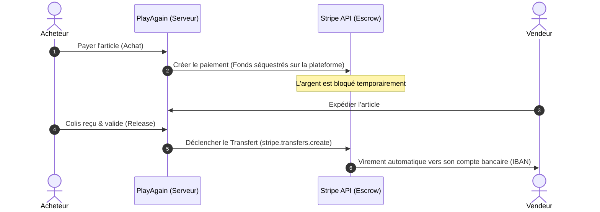
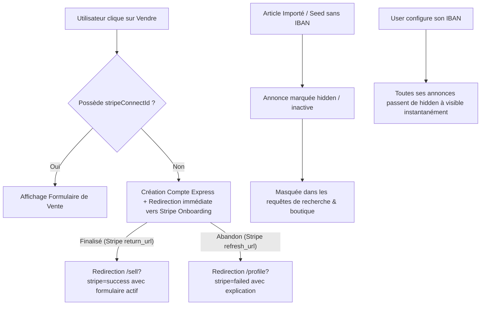

# 🛡️ Intégration des Paiements & Gestion du Séquestre (Stripe Connect)

Ce document décrit l'architecture et les étapes techniques recommandées pour permettre aux vendeurs de l'application **PlayAgain** de configurer leurs coordonnées bancaires (IBAN) de manière sécurisée et réglementaire, puis de recevoir leurs fonds une fois qu'une transaction est validée (fin de séquestre).

---

## 1. ⚖️ Le Contexte Réglementaire & Sécurité

Pour une plateforme de type marketplace C2C (Client-to-Client), **il est formellement déconseillé (et souvent illégal) de collecter, stocker ou manipuler directement des IBAN et des pièces d'identité** sur nos propres serveurs. Les contraintes réglementaires européennes (RGPD, KYC - *Know Your Customer*, directives anti-blanchiment) exigent des licences lourdes et coûteuses.

### La Solution : Stripe Connect (Express)
Puisque **Stripe** est déjà installé sur le projet `play-again` (`stripe` et `@stripe/stripe-js`), nous utilisons **Stripe Connect Express**.
*   **Stripe gère l'onboarding :** L'utilisateur est redirigé vers une page web sécurisée et co-brandée Stripe pour saisir ses coordonnées bancaires et son identité.
*   **Sécurité maximale :** Aucune coordonnée bancaire (IBAN/BIC) ne transite ni n'est stockée dans la base de données de *PlayAgain*.
*   **Conformité automatique :** Stripe se charge de vérifier l'identité de l'utilisateur (KYC).

---

## 2. 🔄 Le Flux Global du Séquestre (Escrow Flow)

Le schéma ci-dessous résume le parcours de l'argent depuis le panier de l'acheteur jusqu'au virement sur le compte bancaire du vendeur :



1. **Achat :** L'acheteur paie. Les fonds arrivent sur le compte Stripe principal de **PlayAgain** (solde séquestre).
2. **Livraison :** Le vendeur envoie l'objet.
3. **Libération :** L'acheteur confirme la réception. L'application met à jour la facture en statut `COMPLETED` et ordonne à Stripe de transférer le montant (moins la commission éventuelle) vers le sous-compte du vendeur.
4. **Versement :** Stripe effectue le virement (Payout) directement sur la banque du vendeur.

---

## 3. 🛠️ Guide d'Implémentation Technique (Pas à pas)

### Étape 1 : Mise à jour du Modèle de Base de Données (`prisma/schema.prisma`)
Nous devons associer chaque utilisateur vendeur à son identifiant de compte connecté Stripe.

Ajouter le champ `stripeConnectId` dans le modèle `User` :
```prisma
model User {
  id              Int            @id @default(autoincrement())
  username        String?        @db.VarChar(50)
  // ... autres champs
  stripeConnectId String?        @unique // Identifiant du sous-compte Stripe Connect
  // ... relations
}
```
*Après modification, lancer : `npx prisma db push` et `npx prisma generate`.*

---

### Étape 2 : Création de la Route d'Onboarding Vendeur
Cette route génère un lien d'inscription Stripe sécurisé. Le vendeur y est redirigé pour entrer son IBAN.

**Fichier suggéré :** `app/api/stripe/onboarding/route.ts`
```typescript
import { NextResponse } from "next/server";
import { auth } from "@/lib/auth";
import prisma from "@/lib/prisma";
import Stripe from "stripe";

const stripe = new Stripe(process.env.STRIPE_SECRET_KEY!, {
  apiVersion: "2025-02-02-preview" as any, // Utiliser la version souhaitée
});

export async function POST(req: Request) {
  try {
    const session = await auth();
    if (!session?.user?.id) {
      return NextResponse.json({ error: "Non autorisé" }, { status: 401 });
    }

    const userId = parseInt(session.user.id);
    const user = await prisma.user.findUnique({ where: { id: userId } });

    if (!user) {
      return NextResponse.json({ error: "Utilisateur non trouvé" }, { status: 404 });
    }

    let stripeAccountId = user.stripeConnectId;

    // 1. Si l'utilisateur n'a pas encore de compte Stripe connecté, on lui en crée un
    if (!stripeAccountId) {
      const account = await stripe.accounts.create({
        type: "express",
        country: "FR", // Ou dynamique selon le pays
        capabilities: {
          transfers: { requested: true }, // Indispensable pour recevoir des virements de séquestre
        },
        business_type: "individual",
        metadata: { userId: user.id.toString() },
      });

      stripeAccountId = account.id;

      // On sauvegarde l'ID Stripe dans notre base de données
      await prisma.user.update({
        where: { id: userId },
        data: { stripeConnectId: stripeAccountId },
      });
    }

    // 2. Générer le lien d'onboarding Stripe Express
    const accountLink = await stripe.accountLinks.create({
      account: stripeAccountId,
      refresh_url: `${process.env.NEXT_PUBLIC_APP_URL}/profile?stripe=failed`,
      return_url: `${process.env.NEXT_PUBLIC_APP_URL}/profile?stripe=success`,
      type: "account_onboarding",
    });

    return NextResponse.json({ url: accountLink.url });
  } catch (error) {
    console.error("Erreur lors de la génération du lien Stripe onboarding:", error);
    return NextResponse.json({ error: "Erreur serveur" }, { status: 500 });
  }
}
```

---

### Étape 3 : Libération des Fonds (Intégration Stripe dans l'API de Release)
Une fois que l'acheteur valide la réception, on effectue le virement Stripe depuis notre compte principal vers le vendeur.

**Fichier à modifier :** `app/api/invoices/[id]/release/route.ts` (au niveau de la validation du statut `COMPLETED`).

```typescript
// ... imports existants
import Stripe from "stripe";

const stripe = new Stripe(process.env.STRIPE_SECRET_KEY!, {
  apiVersion: "2025-02-02-preview" as any,
});

// A l'intérieur de la transaction ou juste après son succès :
await prisma.$transaction(async (tx) => {
  // 1. Passage du statut de la facture à COMPLETED
  await tx.invoice.update({
    where: { id: invoiceId },
    data: { status: "COMPLETED" },
  });

  // 2. Recherche du stripeConnectId du vendeur de l'article
  const seller = await tx.user.findUnique({
    where: { id: item.product.user_id },
    select: { stripeConnectId: true }
  });

  if (seller?.stripeConnectId) {
    // Calcul du montant à verser au vendeur (ex: prix de l'article moins commission éventuelle)
    const amountInCents = Math.round(Number(item.unit_price) * 100); 

    // 3. Virement de séquestre (Transfer) depuis la plateforme vers le vendeur
    await stripe.transfers.create({
      amount: amountInCents,
      currency: "eur",
      destination: seller.stripeConnectId,
      description: `Libération de séquestre - Facture #${invoiceId} - Produit ${item.product.title}`,
      source_transaction: invoice.payment_intent_id || undefined, // Associe le transfert au paiement d'origine
    });
  }

  // 4. Génération de la conversation et du message système
  // ... reste de votre code de messagerie existant
});
```

---

## 4. 🔄 Mise à Jour des Coordonnées Bancaires & Changement de Banque (IBAN)

Si le vendeur change de banque, **vous n'avez pas besoin de créer des formulaires complexes** pour qu'il saisisse son nouvel IBAN sur votre site. Pour des raisons évidentes de sécurité (éviter qu'un hacker ne modifie le compte de virement d'un utilisateur), Stripe gère tout cela de façon ultra-sécurisée via un **Lien de Connexion Express (Login Link)**.

### Le flux de modification :
1. Sur son profil PlayAgain, le vendeur clique sur un bouton : `⚙️ Gérer mes coordonnées bancaires`.
2. Votre serveur appelle l'API Stripe pour générer un lien de connexion unique et temporaire : `stripe.accounts.createLoginLink(stripeConnectId)`.
3. Vous redirigez l'utilisateur vers ce lien sécurisé Stripe.
4. **Authentification forte :** Stripe envoie un code de vérification SMS sur le numéro de téléphone du vendeur (renseigné lors de sa première inscription).
5. Une fois le code saisi, le vendeur accède à son tableau de bord Stripe Express où il peut modifier son IBAN lui-même.
6. Dès qu'il a terminé, Stripe le renvoie sur PlayAgain. La mise à jour est instantanée !

### Code de l'API de génération du lien de connexion :
**Fichier suggéré :** `app/api/stripe/login-link/route.ts`
```typescript
import { NextResponse } from "next/server";
import { auth } from "@/lib/auth";
import prisma from "@/lib/prisma";
import Stripe from "stripe";

const stripe = new Stripe(process.env.STRIPE_SECRET_KEY!, {
  apiVersion: "2025-02-02-preview" as any,
});

export async function POST(req: Request) {
  try {
    const session = await auth();
    if (!session?.user?.id) {
      return NextResponse.json({ error: "Non autorisé" }, { status: 401 });
    }

    const userId = parseInt(session.user.id);
    const user = await prisma.user.findUnique({
      where: { id: userId },
      select: { stripeConnectId: true }
    });

    if (!user || !user.stripeConnectId) {
      return NextResponse.json({ error: "Aucun compte vendeur configuré." }, { status: 400 });
    }

    // Génération du lien de connexion sécurisé Stripe Express
    const loginLink = await stripe.accounts.createLoginLink(user.stripeConnectId);

    return NextResponse.json({ url: loginLink.url });
  } catch (error) {
    console.error("Erreur lors de la création du lien de connexion Stripe :", error);
    return NextResponse.json({ error: "Erreur serveur" }, { status: 500 });
  }
}
```

---

## 5. 📍 Où intégrer ce bouton dans l'interface ?

L'emplacement idéal et le plus intuitif est la **Barre latérale (Sidebar) du Profil Utilisateur** dans le fichier `app/profile/page.tsx`.

### Concept d'intégration dans `app/profile/page.tsx` :
Dans votre structure de code actuelle, vous avez un tableau `sidebarItems` qui génère le menu de navigation. On peut y ajouter dynamiquement l'action bancaire en fonction de la présence de `stripeConnectId` :

#### Code de modification suggéré pour `app/profile/page.tsx` :
1. **Ajouter un bouton ou lien d'action bancaire dans la sidebar :**
```typescript
// Déterminer le lien et le label dynamiquement selon l'état Stripe
const hasStripeAccount = !!user.stripeConnectId;
const stripeLabel = hasStripeAccount ? "Coordonnées bancaires" : "Configurer mes gains";
```

2. **Créer un composant ou un gestionnaire de clic pour le bouton :**
Puisque le composant de la page principale est un *Server Component*, vous pouvez ajouter un bouton interactif (Client Component) ou utiliser un bouton simple qui appelle des Server Actions ou des API en JS :

```tsx
// Exemple de bouton dynamique dans la sidebar :
{hasStripeAccount ? (
  /* Si configuré : Lien direct vers le Login Link Stripe Express */
  <StripeLinkButton 
    actionUrl="/api/stripe/login-link" 
    label="Coordonnées bancaires" 
  />
) : (
  /* Si non configuré : Lien direct vers l'Onboarding Stripe Connect */
  <StripeLinkButton 
    actionUrl="/api/stripe/onboarding" 
    label="Configurer mes gains" 
  />
)}
```

---

## 6. 💡 Conseils d'UX & Recommandations

1. **Vérification de l'état Stripe :** Sur la page de mise en vente ou le profil de l'utilisateur, affichez un badge indiquant si le compte bancaire est correctement lié (ex: en appelant `stripe.accounts.retrieve(stripeConnectId)` et en vérifiant que le champ `charges_enabled` et `payouts_enabled` sont à `true`).
2. **Bouton d'action dynamique sur le profil :**
   * **Si Stripe Connect non configuré (pas d'ID) :** Afficher un bouton `🔗 Configurer mon compte bancaire` (appelle l'API d'onboarding de l'Étape 2).
   * **Si Stripe Connect configuré (ID présent) :** Afficher un bouton `⚙️ Gérer mes coordonnées bancaires / IBAN` (appelle l'API du login-link de l'Étape 4).

---

## 7. 🚀 Stratégie UX/Réglementaire : Gestion des Vendeurs sans IBAN

Pour éviter des situations réglementaires ou de service client complexes (notamment le fait que des articles soient achetés alors que les vendeurs n'ont pas d'IBAN configuré), voici la stratégie d'intégration préventive et progressive. Cette approche permet également de conserver des données de test (seeds) en base sans impacter la boutique publique.

### 🔄 Parcours Utilisateur Réfléchi (Frictionless / Sans Couture) :



---

### 1. 🔀 Redirection Directe vers Stripe Connect (Zéro Friction)
Au lieu de renvoyer le vendeur sur son profil et de lui imposer de cliquer sur un bouton supplémentaire, nous le redirigeons **instantanément** vers le portail de saisie d'IBAN Stripe. Dès qu'il termine, Stripe le renvoie sur la page `/sell` pour remplir son annonce.

Voici comment structurer cette logique directement dans `/app/sell/page.tsx` :

```typescript
// app/sell/page.tsx
import { auth } from "@/lib/auth";
import { redirect } from "next/navigation";
import prisma from "@/lib/prisma";
import Stripe from "stripe";

const stripe = new Stripe(process.env.STRIPE_SECRET_KEY || "");

export default async function SellPage() {
  const session = await auth();
  if (!session?.user?.id) {
    redirect("/auth/login");
  }

  const userId = parseInt(session.user.id);
  const user = await prisma.user.findUnique({
    where: { id: userId },
    select: { id: true, email: true, stripeConnectId: true }
  });

  if (!user) redirect("/auth/login");

  // Si le vendeur n'a pas configuré son compte Stripe Connect (IBAN)
  if (!user.stripeConnectId) {
    let stripeAccountId;

    try {
      // 1. Création à la volée du compte Stripe Express
      const account = await stripe.accounts.create({
        type: "express",
        country: "FR",
        capabilities: {
          transfers: { requested: true },
        },
        business_type: "individual",
        metadata: {
          userId: user.id.toString(),
          email: user.email,
        },
      });

      stripeAccountId = account.id;

      // 2. Enregistrement en base de données
      await prisma.user.update({
        where: { id: userId },
        data: { stripeConnectId: stripeAccountId },
      });
    } catch (err) {
      console.error("Erreur lors de la création du compte connecté Stripe Connect:", err);
      // Fallback de sécurité : redirection vers le profil
      redirect("/profile?stripe=error");
    }

    // 3. Génération du lien d'onboarding avec retour direct vers le formulaire de vente
    const appUrl = process.env.NEXT_PUBLIC_APP_URL || "http://localhost:3000";
    const accountLink = await stripe.accountLinks.create({
      account: stripeAccountId,
      refresh_url: `${appUrl}/profile?stripe=failed`, // Si abandon, retour au profil
      return_url: `${appUrl}/sell?stripe=success`,   // Si complété, retour triomphal au formulaire !
      type: "account_onboarding",
    });

    // 4. Redirection immédiate
    redirect(accountLink.url);
  }

  // Reste du code existant de SellPage (Chargement catégories, marques, formulaires...)
  // ...
}
```

*Avantage majeur : Le tunnel d'onboarding est ultra-fluide. L'utilisateur clique sur "Vendre", saisit son IBAN sur Stripe, et se retrouve immédiatement sur la page de création de son annonce sans clic superflu.*


---

### 2. 👁️ Masquage Intelligent des Annonces Orphelines de Stripe (Hidden Products)
Pour éviter d'afficher des articles de vendeurs non joignables ou issus de données fictives (seeds), nous adaptons le filtre global de recherche et de sélection dans `app/actions/product.ts` (pour `getLatestProducts`, `getRecommendedProducts` et `getFilteredProducts`).

```typescript
// Exemple de filtre de requête Prisma dans app/actions/product.ts
const where: any = {
  is_sold: false,
  is_active: true, // Annonce validée
  user: {
    stripeConnectId: {
      not: null // Le vendeur DOIT avoir configuré Stripe pour que son article soit public
    }
  }
};
```
*Dès que le vendeur finalise son onboarding Stripe Connect, toutes ses annonces s'activent de manière transparente.*

---

### 3. 🔔 Notification In-App et Alerte Profil
Pour rassurer et inciter le vendeur à finaliser son compte, on affiche une notification in-app ou un bandeau d'alerte s'il possède des annonces en attente de publication.

```typescript
// Dans app/profile/page.tsx
const hasHiddenProducts = user.products.some(p => !p.is_sold) && !user.stripeConnectId;
```

Si `hasHiddenProducts` est vrai, un bandeau premium est affiché en haut du profil :
> ⚡ **Action Requise :** Vous avez des équipements prêts à être vendus ! Renseignez vos coordonnées bancaires (IBAN) pour les rendre visibles aux acheteurs.

---

### 4. 💫 Animation "Impulse" (Pulsation Glow) sur le bouton d'activation
Sur la page de profil, s'il y a des annonces cachées, le bouton "Activer mes ventes / Configurer mon IBAN" reçoit une classe d'animation pour attirer le regard de manière esthétique et interactive.

#### Intégration dans `app/profile/page.tsx` :
```tsx
<StripePayoutButton 
  stripeConnectId={user.stripeConnectId} 
  shouldPulse={hasHiddenProducts} // Prop dynamique
/>
```

#### Ajout des Styles & Keyframes dans `app/globals.css` :
```css
@keyframes bounce-subtle {
  0%, 100% {
    transform: scale(1);
    box-shadow: 0 0 15px rgba(125, 56, 255, 0.2);
  }
  50% {
    transform: scale(1.02);
    box-shadow: 0 0 25px rgba(125, 56, 255, 0.55);
  }
}

.animate-pulse-stripe {
  animation: bounce-subtle 2s infinite ease-in-out;
}
```

#### Application dans `/components/profile/StripePayoutButton.tsx` :
```tsx
export function StripePayoutButton({ stripeConnectId, shouldPulse }: StripePayoutButtonProps) {
  // ...
  return (
    <button
      onClick={handleAction}
      className={cn(
        "w-full py-4 rounded-2xl transition-all flex items-center justify-between px-5 border",
        "bg-zinc-900/60 border-brand-primary/20 text-brand-primary",
        // L'effet d'impulsion si l'utilisateur a des annonces en attente d'IBAN
        shouldPulse && "animate-pulse-stripe border-brand-primary/60 shadow-[0_0_25px_rgba(125,56,255,0.4)] ring-2 ring-brand-primary/10"
      )}
    >
      {/* ... */}
    </button>
  );
}
```

---

### 5. 💬 Info-bulle au Survol (Hover Tooltip)
Pour clarifier immédiatement l'effet de la pulsation et rassurer l'utilisateur, nous pouvons ajouter une info-bulle explicative premium au survol du bouton s'il n'a pas configuré son compte :

```tsx
// Exemple d'intégration de l'info-bulle au survol dans StripePayoutButton.tsx
export function StripePayoutButton({ stripeConnectId, shouldPulse }: StripePayoutButtonProps) {
  // ...
  return (
    <div className="relative group w-full">
      <button
        onClick={handleAction}
        className={cn(
          "w-full py-4 rounded-2xl transition-all flex items-center justify-between px-5 border",
          "bg-zinc-900/60 border-brand-primary/20 text-brand-primary",
          shouldPulse && "animate-pulse-stripe border-brand-primary/60 shadow-[0_0_25px_rgba(125,56,255,0.4)] ring-2 ring-brand-primary/10"
        )}
      >
        {/* Contenu du bouton */}
      </button>

      {/* Info-bulle premium en Glassmorphism */}
      {shouldPulse && (
        <div className="absolute bottom-full left-1/2 -translate-x-1/2 mb-3 w-72 p-3.5 rounded-2xl bg-zinc-950/95 border border-brand-primary/30 backdrop-blur-md shadow-2xl opacity-0 translate-y-2 pointer-events-none group-hover:opacity-100 group-hover:translate-y-0 transition-all duration-300 z-50">
          <div className="relative text-left space-y-1">
            <span className="text-[8px] font-black text-brand-primary uppercase tracking-widest block">Statut de vos annonces</span>
            <p className="text-[10px] text-zinc-300 leading-relaxed font-bold">
              Vos articles mis en vente ne seront pas diffusés sur la boutique tant que vous n'aurez pas ajouté votre compte bancaire (IBAN).
            </p>
            {/* Flèche de l'info-bulle */}
            <div className="absolute top-full left-1/2 -translate-x-1/2 w-3 h-3 bg-zinc-950 border-r border-b border-brand-primary/30 rotate-45 mt-1" />
          </div>
        </div>
      )}
    </div>
  );
}
```
*Cette disposition tire pleinement parti des styles visuels haut de gamme déjà présents dans l'application (glassmorphism, couleurs de marque, contrastes sombres).*


