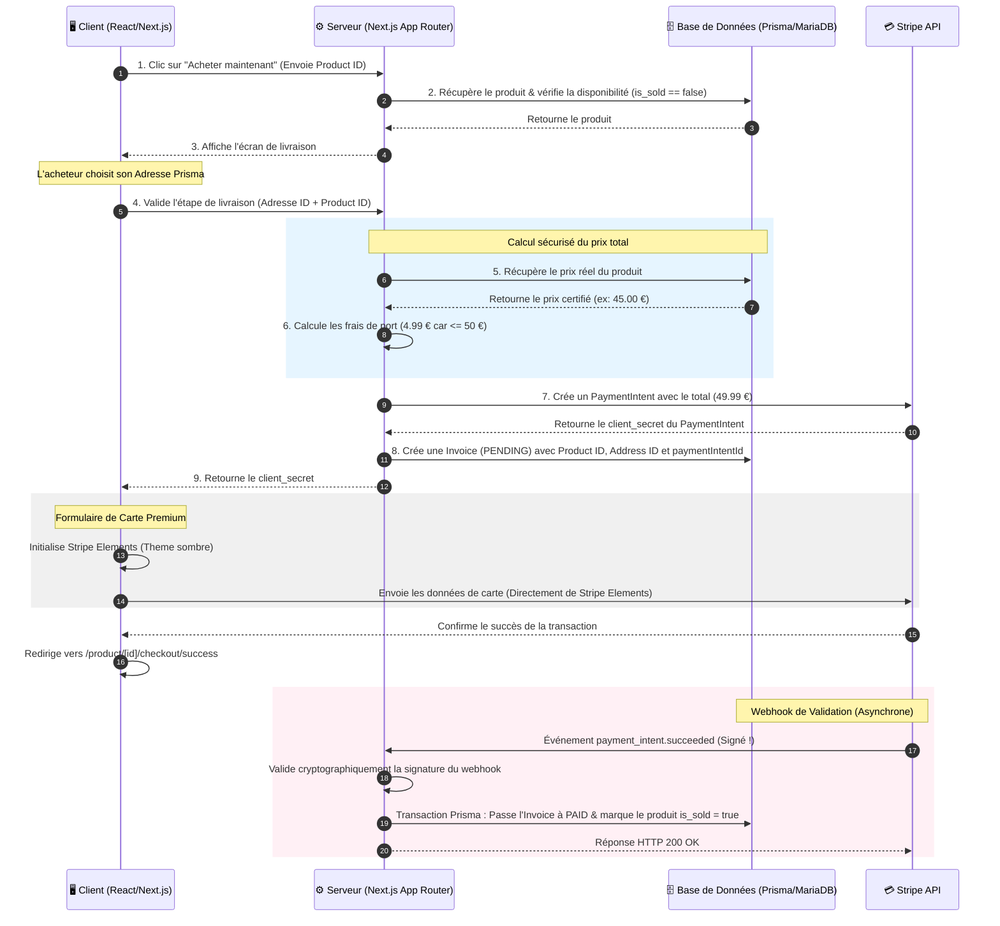

# Conception du Système de Paiement Stripe 💳

Ce document présente l'architecture technique, les principes de sécurité et les lignes directrices de design (UI/UX) pour l'intégration de **Stripe** au sein de **PlayAgain**, suite aux décisions d'architecture validées.

---

## 1. Choix d'Architecture Validés

### A. Flux d'Achat : Achat Direct à l'Unité ("Acheter maintenant")
* **Concept (Modèle P2P type Vinted / Leboncoin) :** Un acheteur trouve un produit unique, clique sur "Acheter", choisit son mode de livraison pour ce vendeur spécifique, et procède au paiement.
* **Simplicité & Robustesse :** Ce flux est parfaitement adapté pour une plateforme Peer-to-Peer. Il évite la complexité des paniers multi-vendeurs (pas de cumul complexe de frais de port de vendeurs différents ni de répartition de paiements Stripe Connect complexes dans un premier temps).
* **Flux de données :** `1 Produit` ➡️ `1 Vendeur` ➡️ `1 Acheteur` ➡️ `1 Paiement`.

### B. Gestion de la Livraison : Contrôle Total sur PlayAgain (Ultra-Premium)
* **Intégration Native :** Avant d'accéder au formulaire Stripe, l'acheteur passe par une étape "Livraison" directement intégrée sur PlayAgain.
* **Gestion des Adresses :** L'utilisateur sélectionne l'une de ses adresses enregistrées (modèle Prisma `Address`) ou en crée une nouvelle.
* **Calcul des Frais de Port côté Serveur :**
  * **Frais standard :** **4,99 €** par transaction.
  * **Seuil de gratuité :** **Gratuit** pour tout produit d'un montant strictement supérieur à **50,00 €**.
  * Le calcul est blindé côté serveur (impossible pour l'utilisateur de modifier ces frais via l'inspecteur).
* **Étape Suivante :** Une fois l'adresse et les frais de livraison validés, le montant total exact (`Prix du Produit + Frais de Port`) est envoyé au serveur pour générer le `PaymentIntent` Stripe.

---

## 2. Flux Technique Global



---

## 3. Principes de Sécurité Cruciaux

* **Calcul du Prix :** La requête de création de paiement ne contient *que* l'ID du produit. La base de données sert de source de vérité pour le prix du produit, auquel s'ajoute l'algorithme des frais de port (4,99 € ou gratuit si > 50 €).
* **Garantie par Webhook :** Le changement de statut du produit en `is_sold: true` et la mise à jour de la facture en `PAID` sont déclenchés exclusivement par le webhook sécurisé `payment_intent.succeeded`.
* **Signature Webhook :** Une clé secrète `STRIPE_WEBHOOK_SECRET` valide l'origine de l'appel pour contrer les requêtes usurpées.

---

## 4. Design UX Premium (Intégration Visuelle)

* **Formulaire Stripe Elements Intégré :** Pas de redirection externe. Un formulaire fluide encapsulé directement dans un panneau latéral ou une page de checkout PlayAgain.
* **Personnalisation Theme Night :**
  ```typescript
  const stripeAppearance = {
    theme: 'night',
    variables: {
      colorPrimary: '#8B5CF6', // Violet Neon
      colorBackground: '#18181B', // Zinc 900
      colorText: '#F4F4F5', // Zinc 100
      colorDanger: '#EF4444',
      fontFamily: 'Inter, sans-serif',
      borderRadius: '12px',
    },
  };
  ```
* **Micro-animations :** Écrans de chargement animés (Skeleton Loaders), bouton d'action avec transition de couleur et spinner d'attente, page de succès immersive (pluie de confettis en canvas, reçu de commande stylisé rétro/arcade).

---

## 5. Guide Pratique Stripe CLI (Tests en Local)

Pour tester localement le webhook sans déployer le serveur, la **Stripe CLI** est indispensable pour rediriger les requêtes Stripe vers ton environnement de développement.

### A. Installation de Stripe CLI (Sous Linux)
Si elle n'est pas déjà installée, voici les commandes rapides pour Linux (Debian/Ubuntu) :

```bash
# 1. Ajouter le dépôt Stripe de paquets
curl -s https://packages.stripe.dev/keyring.gpg | sudo gpg --dearmor -o /usr/share/keyrings/stripe.gpg
echo "deb [signed-by=/usr/share/keyrings/stripe.gpg] https://packages.stripe.dev/debian stable main" | sudo tee /etc/apt/sources.list.d/stripe.list

# 2. Mettre à jour et installer
sudo apt-get update
sudo apt-get install stripe
```

*(Alternative avec binaire direct si besoin : Télécharger l'archive depuis le GitHub officiel `stripe/stripe-cli` et la placer dans `/usr/local/bin`).*

### B. Connexion à ton Compte Stripe
Connecte ton terminal à ton compte de test Stripe :
```bash
stripe login
```
*Cette commande va ouvrir une fenêtre de navigateur pour t'authentifier en un clic.*

### C. Redirection du Webhook (Le Tunnel local)
Lance cette commande dans un terminal séparé pendant que ton serveur Next.js tourne :
```bash
stripe listen --forward-to localhost:3000/api/webhooks/stripe
```
*   La CLI va afficher une clé qui commence par `whsec_...` (ex: `whsec_a1b2c3...`).
*   Copie cette clé et colle-la temporairement dans ton fichier `.env` :
    ```env
    STRIPE_WEBHOOK_SECRET=whsec_a1b2c3...
    ```

---

## 6. Plan de Route Technique pour le Développement

1. **Étape 1 :** Installer les paquets `stripe` et `@stripe/stripe-js` / `@stripe/react-stripe-js`.
2. **Étape 2 :** Créer la route API `/api/checkout` (Next.js route handler) pour créer le `PaymentIntent` à partir du produit et de l'adresse de livraison.
3. **Étape 3 :** Créer le composant de Checkout UI (Sélection de l'adresse Prisma ➡️ calcul des frais de port ➡️ affichage de Stripe Elements personnalisé).
4. **Étape 4 :** Créer la route webhook `/api/webhooks/stripe` pour capturer `payment_intent.succeeded` et valider l'achat en BDD.
5. **Étape 5 :** Réaliser les tests de bout en bout avec Stripe CLI.
