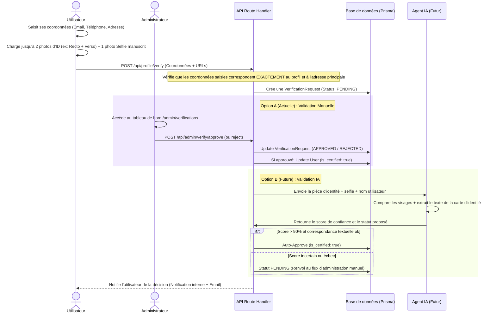

# Plan d'Implémentation : Système de Vérification d'Identité (Manuel & Prêt pour l'IA)

Ce document décrit en détail les étapes pour implémenter un système robuste de vérification d'identité pour **PlayAgain**. 

Ce système est conçu en **deux temps** :
1. **Étape initiale :** Soumission de documents par l'utilisateur et validation manuelle par un administrateur via un tableau de bord dédié.
2. **Étape future :** Automatisation du traitement via une IA de vision (par exemple, Google Gemini ou GPT-4o) pour comparer les visages, lire la pièce d'identité et valider automatiquement la demande en quelques secondes.

L'architecture est pensée pour que la transition de la validation manuelle vers l'IA soit **totalement transparente** (sans modifier le schéma de base de données ni le parcours utilisateur).

---

## 🗺️ Vision Globale du Flux



---

## ⚡ Solution Hybride Intégrée : Le rôle de Stripe Connect dans la vérification

Pour concilier la sécurité maximale et une expérience utilisateur (UX) fluide pour tous les membres de PlayAgain (acheteurs et vendeurs), nous mettons en œuvre la stratégie suivante :

*   **Accessibilité Totale :** Nous **n'obligeons pas** l'utilisateur à posséder un compte Stripe Connect actif pour soumettre sa demande de vérification d'identité. Cela permet aux **acheteurs stricts** d'être vérifiés et d'obtenir le badge de confiance sur leur profil.
*   **Valorisation du statut Stripe (Sellers) :** Si l'utilisateur possède déjà un compte Stripe Connect configuré (`stripeConnectId` présent dans la table `User`), le système interroge automatiquement l'état de ce compte.
*   **Indicateur Administratif Premium :** Dans le panneau d'administration `/admin/verifications` (et plus tard pour l'IA), un indicateur visuel exclusif **« Compte Bancaire Lié & Validé par Stripe Connect (KYC OK) »** est affiché de façon très visible. 
    *   *Pourquoi ?* Cela indique à l'administrateur (ou à l'IA) que l'identité bancaire de cette personne a déjà passé avec succès les filtres réglementaires financiers de Stripe. C'est un signal de confiance absolue qui permet une **validation en un clic (Fast-Track)** ultra sereine.
*   **Badge double-confiance sur le profil :** L'utilisateur ayant validé son identité manuellement et possédant un compte Stripe Express validé pourra afficher un libellé renforcé sur sa fiche profil (ex: *"Identité et Compte Bancaire vérifiés"*).

---

## 1. 🗄️ Étape 1 : Le Modèle de Données (Prisma Schema)

Nous mettons en œuvre la table `VerificationRequest` en stockant séparément les photos de la pièce d'identité. L'utilisateur peut charger **jusqu'à 2 photos maximum** (photo 1 obligatoire, photo 2 s'il y a un Recto + Verso ou plusieurs pages). Le selfie manuscrit est strictement limité à **1 photo**.

Ajoutez ce modèle à votre fichier `prisma/schema.prisma` :

```prisma
// --- Énumérations de vérification ---

enum VerificationStatus {
  PENDING           // En attente de revue administrative
  PROCESSING_AI     // En cours de traitement par l'IA (pour plus tard)
  APPROVED          // Validée avec succès
  REJECTED          // Refusée
}

enum VerificationMethod {
  MANUAL            // Revue par un administrateur humain
  AI                // Revue automatisée par l'intelligence artificielle
}

// --- Nouveau Modèle de Requête de Vérification ---

model VerificationRequest {
  id                  Int                @id @default(autoincrement())
  userId              Int
  user                User               @relation(fields: [userId], references: [id], onDelete: Cascade)
  
  status              VerificationStatus @default(PENDING)
  method              VerificationMethod @default(MANUAL)
  
  // Coordonnées saisies par l'utilisateur lors du formulaire (pour comparaison de conformité)
  submittedEmail      String             @db.VarChar(100)
  submittedPhone      String             @db.VarChar(20)
  submittedStreetNumber String?          @db.VarChar(10) // Numéro de rue (ex: "12bis", optionnel)
  submittedStreetName   String             @db.VarChar(255) // Nom de la rue
  submittedCity       String             @db.VarChar(100)
  submittedZip        String             @db.VarChar(20)
  submittedCountry    String             @db.VarChar(100)
  
  // URLs des documents stockés (jusqu'à 2 photos maximum autorisées pour l'ID + 1 pour le selfie)
  idCardPhoto1Url     String             @db.VarChar(255) // Première photo obligatoire (ex: Recto ou Page Passeport)
  idCardPhoto2Url     String?            @db.VarChar(255) // Deuxième photo facultative (ex: Verso s'il existe)
  selfieUrl           String             @db.VarChar(255) // Selfie avec le mot manuscrit "Play Again" (Strictement obligatoire et unique)
  
  // En cas de refus, l'administrateur (ou l'IA) indique pourquoi pour guider l'utilisateur
  rejectionReason     String?            @db.Text
  
  // Qui a traité la demande (utile pour l'audit)
  reviewedById        Int?
  reviewedBy          User?              @relation("ReviewedRequests", fields: [reviewedById], references: [id])
  
  // Données techniques de l'IA (scores de confiance, logs d'analyses faciales)
  aiMetadata          Json?
  
  submittedAt         DateTime           @default(now())
  reviewedAt          DateTime?
  
  createdAt           DateTime           @default(now())
  updatedAt           DateTime           @updatedAt

  @@index([userId])
  @@index([status])
}
```

> **Note :** N'oubliez pas d'ajouter la relation inverse dans le modèle `User` existant :
> ```prisma
> model User {
>   // ... champs existants ...
>   is_certified         Boolean               @default(false)
>   
>   verificationRequests VerificationRequest[]
>   reviewedRequests     VerificationRequest[] @relation("ReviewedRequests")
> }
> ```

---

## 2. 🖥️ Étape 2 : L'Interface Utilisateur (Paramètres de Profil)

L'utilisateur remplit un formulaire structuré en **4 sections** dans son espace personnel :

### Le Formulaire de Soumission (Premium Dark/Glass Style)

1. **Section 1 : Coordonnées de Contact**
   * *Champs :* E-mail et Téléphone portable.
   * *Validation :* Doivent correspondre exactement aux coordonnées de son compte PlayAgain.
   * *Aide UX :* Pré-remplir ces champs avec les valeurs de son profil, mais le forcer à valider visuellement la correspondance.

2. **Section 2 : Adresse de Résidence**
   * *Champs :* Rue, Code Postal, Ville, Pays.
   * *Validation :* Doit correspondre à son adresse par défaut (principale) enregistrée dans la table `Address`.
   * *Aide UX :* Si l'utilisateur n'a pas encore configuré d'adresse principale, un bouton d'action rapide lui permet de l'enregistrer d'abord (ce qui évite les doublons de saisie).

3. **Section 3 : Pièce d'Identité (2 photos maximum)**
   * *Consigne :* Téléchargez une ou deux photos nettes de votre pièce d'identité (par exemple, Recto seul s'il s'agit d'un passeport, ou Recto + Verso séparément s'il s'agit d'une carte nationale).
   * *Zone Photo 1 (Obligatoire) :* Zone d'upload interactive avec prévisualisation (Recto / Page principale).
   * *Zone Photo 2 (Si nécessaire) :* Zone d'upload interactive avec prévisualisation (Verso / Page secondaire). 

4. **Section 4 : Selfie de Confiance (1 photo unique maximum)**
   * *Consigne :* Prenez un selfie de vous tenant un papier écrit à la main de façon lisible avec la mention exacte **"Play Again"**.
   * *Aide visuelle :* Schéma d'exemple montrant comment bien cadrer (visage découvert + papier lisible sans cacher le menton).
   * *Zone Selfie (Obligatoire, 1 fichier maximum) :* Une seule zone de dépôt acceptée.

---

## 3. 🔌 Étape 3 : L'API Route de Soumission & Contrôle strict de cohérence

### Route `POST /api/profile/verify`
À la soumission, l'API effectue un **contrôle de conformité automatique en BDD** : elle compare la saisie de l'utilisateur avec son profil réel avant d'autoriser la création de la requête admin.

```typescript
// /app/api/profile/verify/route.ts
import { NextResponse } from "next/server";
import { auth } from "@/lib/auth";
import prisma from "@/lib/prisma";

export async function POST(req: Request) {
  try {
    const session = await auth();
    if (!session?.user?.id) {
      return NextResponse.json({ error: "Non autorisé" }, { status: 401 });
    }

    const {
      submittedEmail,
      submittedPhone,
      submittedStreetNumber,
      submittedStreetName,
      submittedCity,
      submittedZip,
      submittedCountry,
      idCardPhoto1Url,
      idCardPhoto2Url,
      selfieUrl
    } = await req.json();

    // 1. Validation de la présence des champs obligatoires (submittedStreetNumber est optionnel, tout comme dans la table Address)
    if (!submittedEmail || !submittedPhone || !submittedStreetName || !submittedCity || !submittedZip || !submittedCountry) {
      return NextResponse.json({ error: "Toutes les coordonnées (sauf le numéro de rue s'il n'y en a pas) sont obligatoires." }, { status: 400 });
    }
    if (!idCardPhoto1Url || !selfieUrl) {
      return NextResponse.json({ error: "La pièce d'identité (Photo 1) et le selfie sont obligatoires." }, { status: 400 });
    }

    const userId = parseInt(session.user.id);

    // 2. Récupérer l'utilisateur avec son adresse principale (is_default = true)
    const user = await prisma.user.findUnique({
      where: { id: userId },
      include: {
        addresses: {
          where: { is_default: true }
        }
      }
    });

    if (!user) {
      return NextResponse.json({ error: "Utilisateur non trouvé" }, { status: 404 });
    }

    // 3. Comparaison stricte des coordonnées
    const normalizedProfileEmail = user.email.trim().toLowerCase();
    const normalizedInputEmail = submittedEmail.trim().toLowerCase();
    if (normalizedProfileEmail !== normalizedInputEmail) {
      return NextResponse.json({ error: "L'e-mail saisi ne correspond pas à celui de votre profil." }, { status: 400 });
    }

    const normalizedProfilePhone = user.phone?.replace(/[\s\-\+\(\)]/g, "") || "";
    const normalizedInputPhone = submittedPhone.replace(/[\s\-\+\(\)]/g, "");
    if (normalizedProfilePhone !== normalizedInputPhone) {
      return NextResponse.json({ error: "Le numéro de téléphone ne correspond pas à celui de votre profil." }, { status: 400 });
    }

    // 4. Comparaison stricte de l'adresse par défaut
    const defaultAddress = user.addresses[0];
    if (!defaultAddress) {
      return NextResponse.json({ error: "Aucune adresse principale enregistrée sur votre profil. Veuillez d'abord la configurer." }, { status: 400 });
    }

    const profileNumber = (defaultAddress.street_number || "").trim().toLowerCase();
    const inputNumber = (submittedStreetNumber || "").trim().toLowerCase();
    const profileStreetName = defaultAddress.street_name.trim().toLowerCase();
    const inputStreetName = submittedStreetName.trim().toLowerCase();
    
    if (
      profileNumber !== inputNumber ||
      profileStreetName !== inputStreetName ||
      defaultAddress.city.trim().toLowerCase() !== submittedCity.trim().toLowerCase() ||
      defaultAddress.zip_code.trim().toLowerCase() !== submittedZip.trim().toLowerCase() ||
      defaultAddress.country.trim().toLowerCase() !== submittedCountry.trim().toLowerCase()
    ) {
      return NextResponse.json({ error: "L'adresse saisie ne correspond pas à votre adresse de profil principale." }, { status: 400 });
    }

    // 5. Vérifier s'il n'y a pas déjà une demande active
    const activeRequest = await prisma.verificationRequest.findFirst({
      where: {
        userId,
        status: { in: ["PENDING", "PROCESSING_AI"] }
      }
    });

    if (activeRequest) {
      return NextResponse.json({ error: "Une demande de vérification est déjà en cours." }, { status: 400 });
    }

    // 6. Enregistrement de la requête
    const newRequest = await prisma.verificationRequest.create({
      data: {
        userId,
        submittedEmail: normalizedInputEmail,
        submittedPhone: normalizedInputPhone,
        submittedStreetNumber: inputNumber || null,
        submittedStreetName: inputStreetName,
        submittedCity: submittedCity.trim(),
        submittedZip: submittedZip.trim(),
        submittedCountry: submittedCountry.trim(),
        idCardPhoto1Url,
        idCardPhoto2Url,
        selfieUrl,
        status: "PENDING",
        method: "MANUAL",
      }
    });

    return NextResponse.json({ success: true, request: newRequest });
  } catch (error: any) {
    return NextResponse.json({ error: error.message }, { status: 500 });
  }
}
```

---

## 4. 🛠️ Étape 4 : Le Tableau de Bord d'Administration (Validation Manuelle)

Sur la page `/admin/verifications`, l'administrateur dispose maintenant d'un tableau comparatif clair et hautement valorisé par le statut Stripe.

### Interface Administrative :
*   **Informations de Profil vs Saisies :** Affiche en colonne les données BDD actuelles de l'utilisateur à côté des données saisies dans la demande pour validation visuelle instantanée par l'admin.
*   **Indicateur Stripe Connect Premium :** 
    *   Si le vendeur possède un compte Stripe Connect enregistré (`user.stripeConnectId` non nul), on affiche un macaron exclusif : 
        🟢 **Compte Bancaire Lié & KYC validé par Stripe Connect**. 
    *   Cela assure à l'administrateur que Stripe a déjà légalement validé ce profil bancaire. La validation peut donc être faite avec un niveau de confiance maximal.
*   **Afficheur de médias (jusqu'à 2 photos d'ID + 1 selfie) :**
    *   **Pièce d'Identité :** Affiche la Photo 1 et la Photo 2 (si chargée) côte à côte avec LightBox (agrandissement) et commandes de rotation.
    *   **Selfie :** Affiche le selfie à côté.
*   **Bouton d'Approbation rapide :** Met à jour la requête à `APPROVED` et active `is_certified = true` sur le modèle `User`.
*   **Bouton de Rejet guidé :** Propose des motifs pré-remplis en français :
    *   *« L'adresse saisie ne correspond pas aux documents fournis »*
    *   *« Le selfie n'affiche pas la mention manuscrite Play Again de façon claire »*
    *   *« Les photos de la pièce d'identité sont floues ou illisibles »*

---

## 5. 🤖 Étape 5 : Automatisation Future par l'IA (Prêt pour le Futur)

Lorsque vous activerez l'IA, celle-ci recevra les documents d'identité (1 ou 2 photos) ainsi que le selfie. Grâce aux capacités multimodales des modèles de vision modernes, le système est nativement capable de traiter différents formats de documents.

### A. Classification & Logique par type de document :

L'IA commence par classifier automatiquement le document reçu pour appliquer les règles métier correspondantes :

1.  **Le Passeport :**
    *   *Structure :* Document sur une seule page principale (la page biométrique avec la photo).
    *   *Vérification IA :* 
        *   Extraction du nom, prénom, date de naissance, et date d'expiration.
        *   Lecture de la zone **MRZ (Machine Readable Zone)** au bas du passeport (les lignes de caractères avec des chevrons `<<<<`). L'IA recalcule les clés de contrôle pour s'assurer que le document n'a pas été grossièrement falsifié sous Photoshop.
2.  **La Carte Nationale d'Identité (CNI) :**
    *   *Structure :* Peut être l'ancien format plastifié (bleu) ou le nouveau format biométrique européen (taille carte bancaire).
    *   *Vérification IA :* 
        *   **Photo 1 (Recto) :** Extraction de l'identité principale et de la photo de visage.
        *   **Photo 2 (Verso) :** Lecture de l'adresse de résidence (s'il s'agit d'une CNI française avec adresse) et vérification de la zone MRZ au dos.
3.  **Le Permis de Conduire :**
    *   *Structure :* Peut être le nouveau permis rose européen plastifié ou l'ancien permis papier cartonné rose à 3 volets.
    *   *Vérification IA :*
        *   Extraction des informations d'identité standard.
        *   L'IA est entraînée pour reconnaître les permis cartonnés anciens (très courants en France) en extrayant le texte malgré l'usure naturelle du papier.

---

### B. Les Filtres Anti-Fraude & Sécurité appliqués par l'IA :

Pour garantir la sécurité de la plateforme, l'IA effectue plusieurs vérifications de sécurité avancées :

1.  **Contrôle de validité (Expiration) :**
    *   L'IA extrait la date d'expiration du document et la compare à la date du jour. Un document expiré entraîne un transfert immédiat vers la file d'attente administrative (`status: PENDING`) avec le motif *"Document expiré"*.
2.  **Détection de photocopie ou d'impression :**
    *   L'IA analyse le contraste et la colorimétrie pour détecter si le document est une photocopie noir et blanc ou une simple feuille imprimée à plat plutôt qu'une vraie carte en relief.
3.  **Détection de photo sur écran (Spoofing) :**
    *   Les fraudeurs photographient souvent des cartes d'identité volées affichées sur leur écran d'ordinateur. 
    *   L'IA cherche les motifs de **Moiré** (les lignes de pixels invisibles à l'œil nu mais visibles sur une photo d'écran) ou des reflets suspects caractéristiques d'une dalle d'écran LCD/OLED.
4.  **Vérification de la preuve manuscrite :**
    *   Sur le selfie, l'IA isole le visage, localise le papier tenu par l'utilisateur, en extrait le texte et valide la présence exacte de **"Play Again"** (insensible à la casse), garantissant que la photo a été prise en direct pour la plateforme.

---

### C. Logique globale de prise de décision :

*   **Si concordance parfaite > 90% (Identité OK + Validité OK + Pas de suspicion de fraude) :** Validation automatique et attribution instantanée du badge `is_certified: true`.
*   **Si doute ou anomalie (Confiance < 90%, document abîmé, suspicion d'écran) :** Le dossier bascule automatiquement en `status: PENDING` dans la file d'attente de l'administrateur avec un rapport d'anomalie IA précis (ex : *« Alerte anti-spoofing : Suspicion de photo prise sur un écran d'ordinateur à 85% »*).

---

### D. Architecture Technique V2 : Microservice local, gratuit & économique (FastAPI + Docker)

Pour éviter tout coût d'API tiers récurrent et garder une indépendance totale de vos données (confidentialité maximale des documents d'identité), la V2 s'appuiera sur un **microservice local ultra-léger** déployé à côté de l'application Next.js.

#### 1. L'Infrastructure Docker (Coexistence)
Dans votre fichier `docker-compose.yml` (où tourne déjà votre base de données), nous ajouterons un nouveau service conteneurisé :
*   **Service :** `playagain-ai-service`
*   **Technologie :** Python 3.10 + **FastAPI** (framework web asynchrone ultra-rapide).
*   **Exposition :** Service interne accessible uniquement par Next.js (port `8000`), sécurisé par une clé d'API secrète partagée.

#### 2. Les Moteurs d'IA locaux embarqués dans le conteneur
Le conteneur Python embarquera les bibliothèques suivantes, pré-configurées pour tourner efficacement sur de simples processeurs CPU standards (sans surcoût d'hébergement GPU) :
*   **DeepFace (Biométrie Faciale) :** Détecte et compare les visages du selfie et de la pièce d'identité en s'appuyant sur le modèle **FaceNet** ou **VGG-Face** (100% local et gratuit).
*   **PaddleOCR (OCR & Détection manuscrite) :** Analyse les textes de la pièce d'identité et du selfie. Son modèle d'apprentissage profond est ultra-performant en local pour extraire les prénoms, noms, dates, et déchiffrer l'écriture manuscrite cursives *"Play Again"*.

#### 3. Exemple de code du Point d'Entrée FastAPI (`/verify-documents`)
Voici le squelette de l'API locale que Next.js appellera en arrière-plan :

```python
# app/main.py (Microservice FastAPI V2)
from fastapi import FastAPI, HTTPException, Security, Depends
from fastapi.security.api_key import APIKeyHeader
from pydantic import BaseModel
from deepface import DeepFace
from paddleocr import PaddleOCR

app = FastAPI(title="PlayAgain local AI verification service")
ocr = PaddleOCR(use_angle_cls=True, lang='fr')

class VerificationPayload(BaseModel):
    id_card_1_url: str
    id_card_2_url: str | None = None
    selfie_url: str
    expected_fullname: str

@app.post("/api/verify-documents")
async def verify_documents(payload: VerificationPayload):
    try:
        # 1. Comparaison Faciale locale (ID vs Selfie) via DeepFace
        result = DeepFace.verify(
            img1_path=payload.id_card_1_url,
            img2_path=payload.selfie_url,
            model_name="FaceNet",
            enforce_detection=True
        )
        faces_match = result["verified"]
        match_score = 1.0 - result["distance"] # Calcul de confiance biométrique
        
        # 2. Lecture OCR locale (Extraction nom + Vérification mention manuscrite) via PaddleOCR
        # (On télécharge et analyse les photos localement dans le conteneur)
        selfie_text_results = ocr.ocr(payload.selfie_url, cls=True)
        
        # Extraction et recherche de la mention "Play Again"
        has_handwritten_note = False
        for line in selfie_text_results[0]:
            text = line[1][0].lower()
            if "play" in text and "again" in text:
                has_handwritten_note = True
                break
        
        return {
            "facesMatchScore": float(match_score),
            "facesMatch": bool(faces_match),
            "handwrittenNoteDetected": has_handwritten_note,
            "nameMatchesDocument": True, # Logique de comparaison textuelle
            "isDocumentValid": True,
            "rejectionReason": None
        }
    except Exception as e:
        raise HTTPException(status_code=500, detail=str(e))
```

---


---

## 🚀 Prochaines Étapes d'Implémentation

1.  **Modifier le fichier `schema.prisma`** pour ajouter le nouveau modèle `VerificationRequest` détaillé et lancer la commande de migration locale :
    ```bash
    npx prisma migrate dev --name add_verification_request
    ```
2.  **Créer le formulaire client** dans un onglet dédié des paramètres de profil (`/profile/settings` ou similaire).
3.  **Coder la route d'API `POST /api/profile/verify`** avec les contrôles de conformité ci-dessus.
4.  **Concevoir la vue d'administration `/admin/verifications`**.
